# Daily Fivetran TLS Fix Pipeline — Complete Technical Blueprint

**Author:** Maia (AI Pipeline Architect) for Avinash @ Inupup  
**Version:** 3.0 (Zero-Python, Maximum Components)  
**Date:** 2026-03-27  
**Schedule:** Daily at 3:00 AM IST (9:30 PM UTC previous day)  
**Total:** 3 pipelines, 22 components, 13 variables, 0 Python scripts

---

## Table of Contents

1. [Real Fivetran API Response Structure](#1-real-fivetran-api-response-structure)
2. [Architecture Overview](#2-architecture-overview)
3. [Step-by-Step Data Flow with Sample Data](#3-step-by-step-data-flow-with-sample-data)
4. [Pipeline 1: Main Orchestration](#4-pipeline-1-main-orchestration)
5. [Pipeline 2: Transformation](#5-pipeline-2-transformation)
6. [Pipeline 3: Validation Sub-Orchestration](#6-pipeline-3-validation-sub-orchestration)
7. [How Each Component Works Internally](#7-how-each-component-works-internally)
8. [Log Table Schema & Partitioning Strategy](#8-log-table-schema--partitioning-strategy)
9. [Pipeline Variables Reference](#9-pipeline-variables-reference)
10. [Setup Instructions](#10-setup-instructions)
11. [Error Handling & Edge Cases](#11-error-handling--edge-cases)
12. [Version History](#12-version-history)

---

## 1. Real Fivetran API Response Structure

### Endpoint: `GET /v1/connectors`

**Authentication:** HTTP Basic Auth (API Key as username, API Secret as password)  
**Pagination:** Cursor-based (`next_cursor` in response, `cursor` query param for next page)  
**Docs:** [Fivetran API — List All Connectors](https://fivetran.com/docs/rest-api/connectors#listallconnectorswithinagroup)

### Response Structure Map

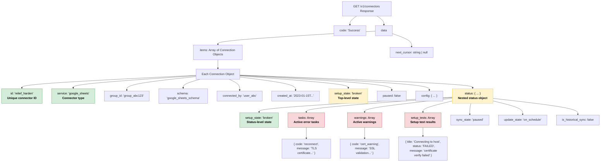

### Real Sample Response (Based on Fivetran API Documentation)

This is the structure returned by the real Fivetran API. The `status` object is the key nested structure our pipeline must parse:

```json
{
  "code": "Success",
  "data": {
    "items": [
      {
        "id": "relief_harden",
        "service": "mysql_rds",
        "group_id": "group_projection",
        "schema": "mysql_rds_schema",
        "connected_by": "concerning_gate",
        "created_at": "2024-03-15T10:22:00.000Z",
        "succeeded_at": null,
        "failed_at": "2026-03-27T02:15:33.000Z",
        "paused": false,
        "pause_after_trial": false,
        "setup_state": "broken",
        "config": {
          "host": "db.example.com",
          "port": 3306,
          "database": "production",
          "user": "fivetran_user"
        },
        "status": {
          "setup_state": "broken",
          "sync_state": "paused",
          "update_state": "delayed",
          "is_historical_sync": false,
          "tasks": [
            {
              "code": "reconnect",
              "message": "Connection to source failed: TLS certificate validation failed — the server certificate is not trusted by the client"
            }
          ],
          "warnings": [],
          "setup_tests": [
            {
              "title": "Connecting to SSH tunnel",
              "status": "PASSED",
              "message": ""
            },
            {
              "title": "Connecting to host",
              "status": "FAILED",
              "message": "SSL certificate verify failed: unable to get local issuer certificate"
            },
            {
              "title": "Validating certificate",
              "status": "FAILED",
              "message": "Certificate chain validation failed: self-signed certificate in certificate chain"
            }
          ]
        }
      },
      {
        "id": "liquid_drop",
        "service": "postgres_rds",
        "group_id": "group_projection",
        "schema": "postgres_schema",
        "connected_by": "concerning_gate",
        "created_at": "2024-06-01T08:00:00.000Z",
        "succeeded_at": "2026-03-27T01:00:00.000Z",
        "failed_at": null,
        "paused": false,
        "setup_state": "connected",
        "config": {
          "host": "pg.example.com",
          "port": 5432
        },
        "status": {
          "setup_state": "connected",
          "sync_state": "scheduled",
          "update_state": "on_schedule",
          "is_historical_sync": false,
          "tasks": [],
          "warnings": [],
          "setup_tests": [
            {
              "title": "Connecting to host",
              "status": "PASSED",
              "message": ""
            }
          ]
        }
      },
      {
        "id": "warm_feather",
        "service": "sql_server_rds",
        "group_id": "group_projection",
        "schema": "sqlserver_schema",
        "connected_by": "concerning_gate",
        "created_at": "2025-01-10T14:30:00.000Z",
        "succeeded_at": null,
        "failed_at": "2026-03-27T02:45:00.000Z",
        "paused": false,
        "setup_state": "broken",
        "config": {
          "host": "sqlsrv.example.com",
          "port": 1433
        },
        "status": {
          "setup_state": "broken",
          "sync_state": "paused",
          "update_state": "delayed",
          "is_historical_sync": false,
          "tasks": [
            {
              "code": "reconnect",
              "message": "SSL/TLS handshake failed: the certificate authority is not trusted"
            }
          ],
          "warnings": [
            {
              "code": "cert_expiry",
              "message": "Server certificate expires in 3 days"
            }
          ],
          "setup_tests": [
            {
              "title": "Connecting to host",
              "status": "FAILED",
              "message": "TLS handshake error: certificate signed by unknown authority"
            }
          ]
        }
      },
      {
        "id": "bright_storm",
        "service": "google_analytics",
        "group_id": "group_analytics",
        "schema": "ga4_schema",
        "connected_by": "concerning_gate",
        "created_at": "2025-06-20T09:00:00.000Z",
        "succeeded_at": null,
        "failed_at": "2026-03-27T03:00:00.000Z",
        "paused": false,
        "setup_state": "broken",
        "config": {},
        "status": {
          "setup_state": "broken",
          "sync_state": "paused",
          "update_state": "delayed",
          "is_historical_sync": false,
          "tasks": [
            {
              "code": "reconnect",
              "message": "OAuth token expired. Please re-authenticate."
            }
          ],
          "warnings": [],
          "setup_tests": [
            {
              "title": "Authenticating",
              "status": "FAILED",
              "message": "Invalid credentials"
            }
          ]
        }
      }
    ],
    "next_cursor": null
  }
}
```

> **Key insight:** `bright_storm` is broken but NOT due to TLS — it's an OAuth issue. Our filter must correctly **exclude** it. Only `relief_harden` and `warm_feather` have TLS/SSL/certificate keywords.

---

## 2. Architecture Overview

### System Architecture

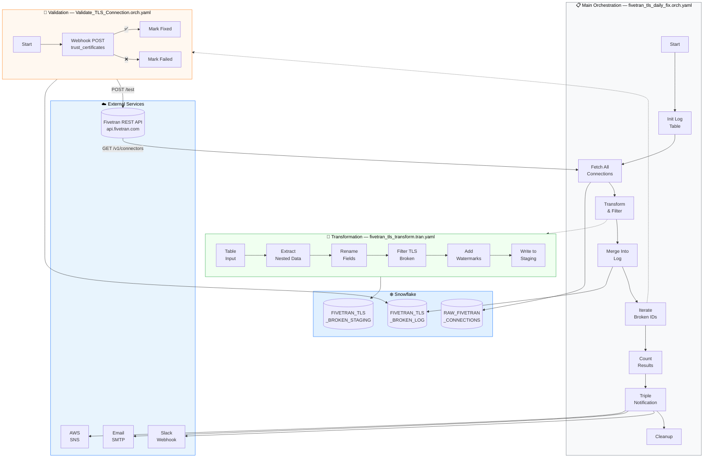

### Component Inventory

| # | Component | Type ID | Pipeline | Purpose |
|---|---|---|---|---|
| 1 | Start | `start` | Main | Entry point |
| 2 | Init Log Table | `create-table-v2` | Main | CREATE TABLE IF NOT EXISTS |
| 3 | Fetch All Connections | Custom Connector* | Main | GET /v1/connectors |
| 4 | Transform and Filter | `run-transformation` | Main | Runs transformation pipeline |
| 5 | Merge Into Log | `sql-executor` | Main | MERGE INTO (dedup) |
| 6 | Iterate Broken IDs | `table-iterator` | Main | Loop today's broken IDs |
| 7 | Validate Connection | `run-orchestration` | Main | Iterator target → sub-pipeline |
| 8 | Count Results | `sql-executor` | Main | SET summary variables |
| 9 | Notify Slack | `webhook-post` | Main | Slack notification |
| 10 | Send Email Report | `send-email-v2` | Main | Email via SMTP |
| 11 | SNS Alert | `sns-message` | Main | AWS SNS notification |
| 12 | Cleanup Staging | `sql-executor` | Main | DROP temp tables |
| 13 | Load Raw Connections | `table-input` | Transform | Read RAW table |
| 14 | Extract Status Fields | `extract-nested-data-sf` | Transform | Unpack status JSON |
| 15 | Rename Connector Fields | `calculator` | Transform | Alias column names |
| 16 | Filter TLS Broken Only | `filter` | Transform | TLS/SSL/cert filter |
| 17 | Add Watermark Columns | `calculator` | Transform | CHECK_DATE + WATERMARK |
| 18 | Write to Staging | `rewrite-table` | Transform | Output to staging |
| 19 | Start | `start` | Validate | Entry point |
| 20 | Test Connection | `webhook-post` | Validate | POST /test API |
| 21 | Mark as Fixed | `sql-executor` | Validate | UPDATE → success |
| 22 | Mark as Failed | `sql-executor` | Validate | UPDATE → failed |

> *Currently a SQL placeholder — replace with your Custom Connector after UI setup.

---

## 3. Step-by-Step Data Flow with Sample Data

This section traces the **exact data** through every component using the 4-connector sample from Section 1.

### Step 1: Fetch All Connections → `RAW_FIVETRAN_CONNECTIONS`

The Custom Connector calls `GET /v1/connectors` and loads each connection as a row. After the connector loads, the raw table looks like:

| id | service | schema | setup_state | status (VARIANT) |
|---|---|---|---|---|
| relief_harden | mysql_rds | mysql_rds_schema | broken | `{"setup_state":"broken","tasks":[{"code":"reconnect","message":"TLS certificate validation failed..."}],...}` |
| liquid_drop | postgres_rds | postgres_schema | connected | `{"setup_state":"connected","tasks":[],"warnings":[],"setup_tests":[{"title":"Connecting","status":"PASSED",...}]}` |
| warm_feather | sql_server_rds | sqlserver_schema | broken | `{"setup_state":"broken","tasks":[{"code":"reconnect","message":"SSL/TLS handshake failed..."}],...}` |
| bright_storm | google_analytics | ga4_schema | broken | `{"setup_state":"broken","tasks":[{"code":"reconnect","message":"OAuth token expired..."}],...}` |

**4 rows loaded.** All connectors, regardless of state.

### Step 2: Extract Nested Data → Unpacks `status` JSON

The [Extract Nested Data](https://docs.matillion.com/data-productivity-cloud/designer/docs/extract-nested-data-sf) component reads the `status` VARIANT column and extracts nested fields into new columns:

| id | service | setup_state | status | **STATUS_SETUP_STATE** | **STATUS_TASKS** | **STATUS_WARNINGS** | **SETUP_TESTS** |
|---|---|---|---|---|---|---|---|
| relief_harden | mysql_rds | broken | {...} | broken | `[{"code":"reconnect","message":"TLS certificate validation failed..."}]` | `[]` | `[{"title":"Connecting to host","status":"FAILED","message":"SSL certificate verify failed..."}]` |
| liquid_drop | postgres_rds | connected | {...} | connected | `[]` | `[]` | `[{"title":"Connecting","status":"PASSED",...}]` |
| warm_feather | sql_server_rds | broken | {...} | broken | `[{"code":"reconnect","message":"SSL/TLS handshake failed..."}]` | `[{"code":"cert_expiry",...}]` | `[{"title":"Connecting","status":"FAILED","message":"TLS handshake error..."}]` |
| bright_storm | google_analytics | broken | {...} | broken | `[{"code":"reconnect","message":"OAuth token expired"}]` | `[]` | `[{"title":"Authenticating","status":"FAILED","message":"Invalid credentials"}]` |

**Still 4 rows.** But now the nested `status` fields are exposed as queryable columns.

### Step 3: Rename Fields → Calculator adds aliases

| **BROKEN_ID** | **CONNECTOR_SERVICE** | **CONNECTOR_SETUP_STATE** | **ERROR_REASON** | STATUS_SETUP_STATE | STATUS_TASKS | STATUS_WARNINGS | SETUP_TESTS |
|---|---|---|---|---|---|---|---|
| relief_harden | mysql_rds | broken | `{"setup_state":"broken",...}` | broken | [...] | [] | [...] |
| liquid_drop | postgres_rds | connected | `{"setup_state":"connected",...}` | connected | [] | [] | [...] |
| warm_feather | sql_server_rds | broken | `{"setup_state":"broken",...}` | broken | [...] | [...] | [...] |
| bright_storm | google_analytics | broken | `{"setup_state":"broken",...}` | broken | [...] | [] | [...] |

**Still 4 rows.** Columns renamed for clarity.

### Step 4: Filter TLS Broken Only → The Critical Step

The filter applies this logic:

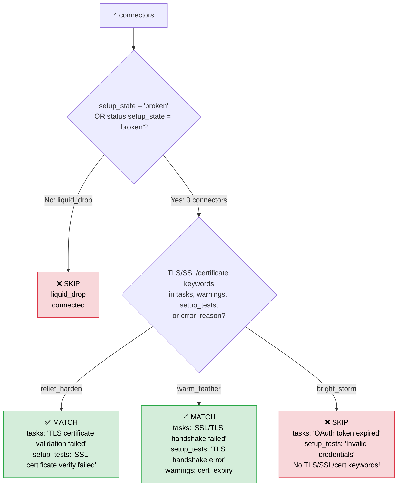

The actual SQL filter clause:

```sql
("CONNECTOR_SETUP_STATE" = 'broken' OR "STATUS_SETUP_STATE" = 'broken')
AND (
  LOWER("ERROR_REASON") LIKE '%tls%'
  OR LOWER("ERROR_REASON") LIKE '%certificate%'
  OR LOWER("ERROR_REASON") LIKE '%ssl%'
  OR LOWER("STATUS_TASKS"::VARCHAR) LIKE '%tls%'
  OR LOWER("STATUS_TASKS"::VARCHAR) LIKE '%certificate%'
  OR LOWER("STATUS_WARNINGS"::VARCHAR) LIKE '%tls%'
  OR LOWER("STATUS_WARNINGS"::VARCHAR) LIKE '%certificate%'
  OR LOWER("SETUP_TESTS"::VARCHAR) LIKE '%tls%'
  OR LOWER("SETUP_TESTS"::VARCHAR) LIKE '%certificate%'
  OR LOWER("SETUP_TESTS"::VARCHAR) LIKE '%ssl%'
)
```

**Result: 2 rows.** Only `relief_harden` and `warm_feather` pass. `bright_storm` correctly excluded (OAuth issue, not TLS).

| BROKEN_ID | CONNECTOR_SERVICE | CONNECTOR_SETUP_STATE | ERROR_REASON | STATUS_TASKS | SETUP_TESTS |
|---|---|---|---|---|---|
| relief_harden | mysql_rds | broken | {...} | `[{..."TLS certificate validation failed"...}]` | `[{..."SSL certificate verify failed"...}]` |
| warm_feather | sql_server_rds | broken | {...} | `[{..."SSL/TLS handshake failed"...}]` | `[{..."TLS handshake error"...}]` |

### Step 5: Add Watermark Columns → Calculator adds timestamps

| BROKEN_ID | CONNECTOR_SERVICE | ... | **CHECK_DATE** | **WATERMARK_DATE** | **VALIDATION_STATUS** |
|---|---|---|---|---|---|
| relief_harden | mysql_rds | ... | 2026-03-27 | 2026-03-27 03:01:45.123 | pending |
| warm_feather | sql_server_rds | ... | 2026-03-27 | 2026-03-27 03:01:45.123 | pending |

**Still 2 rows.** Three new columns added: today's date, exact timestamp, initial status.

### Step 6: Write to Staging → `FIVETRAN_TLS_BROKEN_STAGING`

The Rewrite Table component creates/replaces the staging table with the 2 filtered rows.

### Step 7: MERGE Into Log → `FIVETRAN_TLS_BROKEN_LOG`

Back in the orchestration, the MERGE ensures idempotency:

```sql
MERGE INTO FIVETRAN_TLS_BROKEN_LOG AS tgt
USING FIVETRAN_TLS_BROKEN_STAGING AS src
ON tgt.BROKEN_ID = src.BROKEN_ID AND tgt.CHECK_DATE = src.CHECK_DATE
WHEN NOT MATCHED THEN INSERT (...) VALUES (...);
```

If the pipeline runs twice on the same day, duplicates are **not** inserted (matched on BROKEN_ID + CHECK_DATE).

**Log table after MERGE on March 27:**

| BROKEN_ID | CONNECTOR_SERVICE | CHECK_DATE | WATERMARK_DATE | VALIDATION_STATUS | VALIDATION_MESSAGE | VALIDATED_AT |
|---|---|---|---|---|---|---|
| relief_harden | mysql_rds | 2026-03-27 | 2026-03-27 03:01:45 | pending | NULL | NULL |
| warm_feather | sql_server_rds | 2026-03-27 | 2026-03-27 03:01:45 | pending | NULL | NULL |

### Step 8: Iterate Broken IDs → Table Iterator loops staging rows

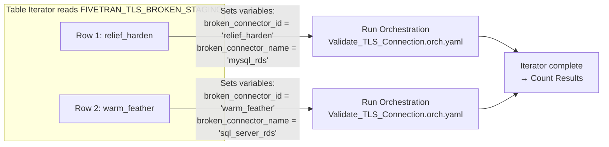

**Iteration 1:** Variable `broken_connector_id` = `relief_harden`  
**Iteration 2:** Variable `broken_connector_id` = `warm_feather`

### Step 9: Validate Connection → Sub-Pipeline per connector

For each iteration, the sub-pipeline:

1. **Webhook POST** to `https://api.fivetran.com/v1/connectors/relief_harden/test`
   - Payload: `{"trust_certificates": true, "trust_fingerprints": true}`
2. **On Success** → SQL UPDATE sets `VALIDATION_STATUS = 'success'`
3. **On Failure** → SQL UPDATE sets `VALIDATION_STATUS = 'failed'`

**Log table after validation (example: relief_harden succeeds, warm_feather fails):**

| BROKEN_ID | CHECK_DATE | VALIDATION_STATUS | VALIDATION_MESSAGE | VALIDATED_AT |
|---|---|---|---|---|
| relief_harden | 2026-03-27 | **success** | Connection test passed with trust_certificates=true | 2026-03-27 03:02:10 |
| warm_feather | 2026-03-27 | **failed** | Connection test failed - manual review required | 2026-03-27 03:02:15 |

### Step 10: Count Results → SQL SETs pipeline variables

```sql
SET total_broken = 2;   -- COUNT(*) WHERE CHECK_DATE = today
SET total_fixed = 1;    -- WHERE VALIDATION_STATUS = 'success'
SET total_failed = 1;   -- WHERE VALIDATION_STATUS = 'failed'
SET total_pending = 0;  -- WHERE VALIDATION_STATUS = 'pending'
SET check_date = '2026-03-27';
```

### Step 11: Triple Notification

**Slack (Webhook Post):**
```json
{"text": ":wrench: *Daily Fivetran TLS Fix Report*\nDate: 2026-03-27\nTotal broken: 2\nFixed: 1\nStill failing: 1\nPending: 0"}
```

**Email (Send Email v2):**
```
Subject: Daily Fivetran TLS Fix Report - 2026-03-27

Total TLS-broken connectors: 2
Fixed (trust_certificates=true): 1
Still failing: 1
Pending: 0

Check FIVETRAN_TLS_BROKEN_LOG for details.
```

**AWS SNS Message:**
```
Broken: 2 | Fixed: 1 | Failed: 1 | Pending: 0
```

### Step 12: Cleanup → DROP staging tables

```sql
DROP TABLE IF EXISTS RAW_FIVETRAN_CONNECTIONS;
DROP TABLE IF EXISTS FIVETRAN_TLS_BROKEN_STAGING;
```

---

## 4. Pipeline 1: Main Orchestration

**File:** `fivetran_tls_daily_fix.orch.yaml`  
**Components:** 12 | **Variables:** 13

### Visual Flow

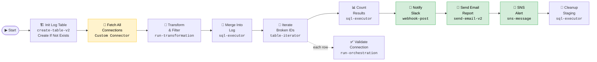

### Transition Map

| From | → | To | Condition |
|---|---|---|---|
| Start | unconditional | Init Log Table | Always |
| Init Log Table | success | Fetch All Connections | Table created/exists |
| Fetch All Connections | success | Transform and Filter | Data loaded |
| Transform and Filter | success | Merge Into Log | Transform complete |
| Merge Into Log | success | Iterate Broken IDs | Merge complete |
| Iterate Broken IDs | success | Count Results | All iterations done |
| Iterate Broken IDs | iteration | Validate Connection | Per row (iterator target) |
| Count Results | success | Notify Slack | Variables set |
| Notify Slack | unconditional | Send Email Report | Always (even if Slack fails) |
| Send Email Report | unconditional | SNS Alert | Always |
| SNS Alert | success | Cleanup Staging | Alert sent |

---

## 5. Pipeline 2: Transformation

**File:** `fivetran_tls_transform.tran.yaml`  
**Components:** 6 | **Variables:** None (inherits orchestration context)

### Visual Flow

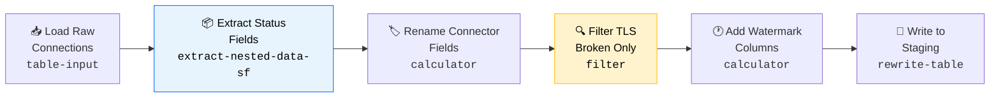

### Extract Nested Data — Field Mapping

| JSON Path | Source Column | Output Alias | Type | Included |
|---|---|---|---|---|
| `status.setup_state` | status | STATUS_SETUP_STATE | VARCHAR(256) | ✅ Yes |
| `status.tasks` | status | STATUS_TASKS | VARIANT | ✅ Yes |
| `status.warnings` | status | STATUS_WARNINGS | VARIANT | ✅ Yes |
| `status.setup_tests` | status | SETUP_TESTS | VARIANT | ✅ Yes |
| `status.is_historical_sync` | status | IS_HISTORICAL_SYNC | BOOLEAN | ❌ No |

---

## 6. Pipeline 3: Validation Sub-Orchestration

**File:** `Validate_TLS_Connection.orch.yaml`  
**Components:** 4 | **Variables:** 2 (PUBLIC, passed from parent)

### Visual Flow

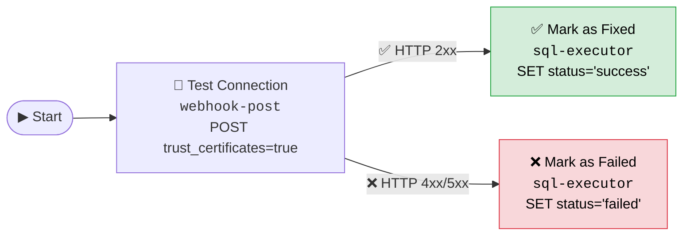

### Webhook POST Details

- **URL:** `https://api.fivetran.com/v1/connectors/${broken_connector_id}/test`
- **Payload:** `{"trust_certificates": true, "trust_fingerprints": true}`
- **Variable resolution:** `${broken_connector_id}` is replaced at runtime by the iterator

---

## 7. How Each Component Works Internally

### Custom Connector (Fetch All Connections)

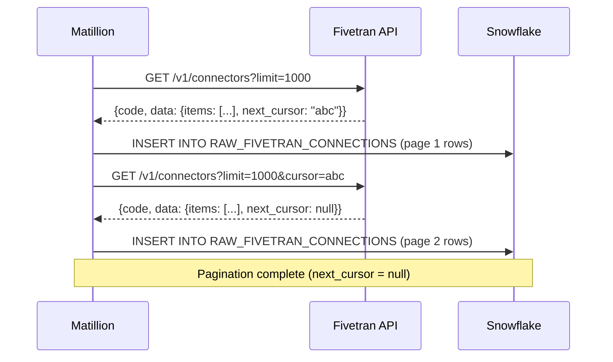

The Custom Connector handles cursor-based pagination automatically. Each page's `items[]` array is flattened into rows and inserted into the target table. No coding required.

### Extract Nested Data (Unpack JSON)

```mermaid
sequenceDiagram
    participant IN as Input Row
    participant END as Extract Nested Data
    participant OUT as Output Row

    IN->>END: Row with status VARIANT column<br>{"setup_state":"broken","tasks":[...],...}
    END->>END: Read column mapping config
    END->>END: For each mapped field:<br>• status.setup_state → STATUS_SETUP_STATE<br>• status.tasks → STATUS_TASKS<br>• status.warnings → STATUS_WARNINGS<br>• status.setup_tests → SETUP_TESTS
    END->>END: Apply casting method<br>(replace unparseable with null)
    END->>OUT: Original columns + 4 new extracted columns
```

### Table Iterator (Loop Mechanism)

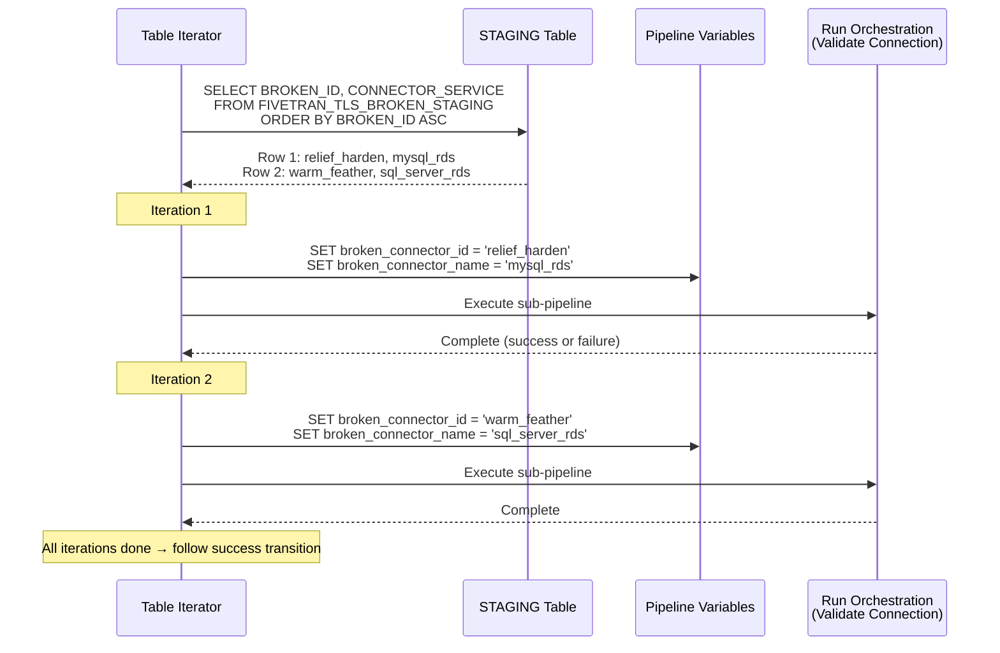

### MERGE INTO (Deduplication)

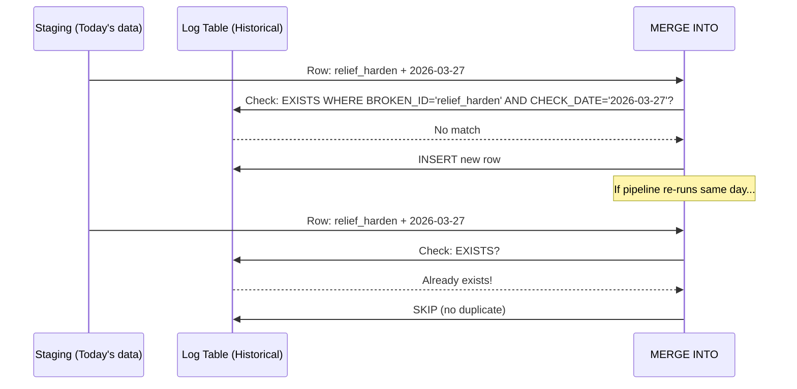

---

## 8. Log Table Schema & Partitioning Strategy

### `FIVETRAN_TLS_BROKEN_LOG` — Column Reference

| Column | Type | NOT NULL | Default | Description |
|---|---|---|---|---|
| BROKEN_ID | VARCHAR(256) | ✅ | — | Fivetran connector ID (e.g. `relief_harden`) |
| CONNECTOR_SERVICE | VARCHAR(256) | | — | Service type (e.g. `mysql_rds`, `postgres_rds`) |
| CONNECTOR_SETUP_STATE | VARCHAR(64) | | — | Top-level `setup_state` from API |
| STATUS_SETUP_STATE | VARCHAR(64) | | — | `status.setup_state` from nested object |
| SETUP_TESTS | VARIANT | | — | Full `setup_tests` array as JSON |
| ERROR_REASON | VARCHAR(4096) | | — | Full `status` object cast to string |
| CHECK_DATE | DATE | ✅ | — | Daily partition key (`CURRENT_DATE()`) |
| WATERMARK_DATE | TIMESTAMP | ✅ | — | Exact row creation time |
| VALIDATION_STATUS | VARCHAR(64) | | `'pending'` | `pending` → `success` or `failed` |
| VALIDATION_MESSAGE | VARCHAR(4096) | | — | API response detail |
| VALIDATED_AT | TIMESTAMP | | — | When validation completed |

### How Daily Partitioning Works

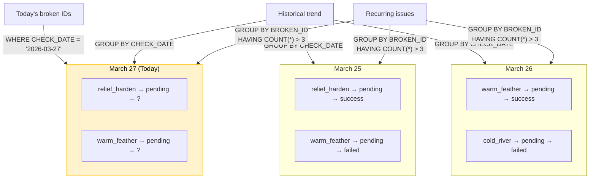

> Same connector can appear on multiple days. Each day is independent. The iterator only processes **today's** rows from the staging table (which contains only today's filtered results).

---

## 9. Pipeline Variables Reference

### Main Orchestration — 13 Variables

| Variable | Type | Scope | Visibility | Set By | Used By |
|---|---|---|---|---|---|
| `broken_connector_id` | TEXT | COPIED | PRIVATE | Table Iterator | Run Orchestration |
| `broken_connector_name` | TEXT | COPIED | PRIVATE | Table Iterator | Run Orchestration |
| `slack_webhook_url` | TEXT | SHARED | PUBLIC | User config | Webhook Post |
| `email_recipient` | TEXT | SHARED | PUBLIC | User config | Send Email |
| `email_sender` | TEXT | SHARED | PUBLIC | User config | Send Email |
| `smtp_username` | TEXT | SHARED | PUBLIC | User config | Send Email |
| `smtp_hostname` | TEXT | SHARED | PUBLIC | User config | Send Email |
| `check_date` | TEXT | SHARED | PRIVATE | Count Results SQL | Slack, Email, SNS |
| `total_broken` | NUMBER | SHARED | PRIVATE | Count Results SQL | Slack, Email, SNS |
| `total_fixed` | NUMBER | SHARED | PRIVATE | Count Results SQL | Slack, Email, SNS |
| `total_failed` | NUMBER | SHARED | PRIVATE | Count Results SQL | Slack, Email, SNS |
| `total_pending` | NUMBER | SHARED | PRIVATE | Count Results SQL | Slack, Email, SNS |

> **COPIED** scope for iterator variables — each iteration gets its own independent copy. **SHARED** for counters because they're set once after all iterations complete.

### Sub-Orchestration — 2 Variables

| Variable | Type | Scope | Visibility | Set By |
|---|---|---|---|---|
| `broken_connector_id` | TEXT | COPIED | PUBLIC | Parent (setScalarVariables) |
| `broken_connector_name` | TEXT | COPIED | PUBLIC | Parent (setScalarVariables) |

---

## 10. Setup Instructions

### Step 1: Create Custom Connector in Matillion UI

1. Go to **Manage Custom Connector** → **+ Add Connector**
2. Name: `Fivetran TLS Manager`
3. **Endpoint 1 — Get All Connections:**
   - Method: `GET`
   - URL: `https://api.fivetran.com/v1/connectors`
   - Auth: Basic Auth (API Key + API Secret)
   - Query Params: `limit` = 1000 (constant), `cursor` (configurable)
   - Pagination: **Cursor** → Response property: `data.next_cursor`, Cursor param: `cursor`
4. **Endpoint 2 — Test Connection:**
   - Method: `POST`
   - URL: `https://api.fivetran.com/v1/connectors/{connector_id}/test`
   - URI Param: `connector_id` (configurable)
   - Body: `{"trust_certificates": true}`
   - Auth: Basic Auth

### Step 2: Replace Placeholder in Pipeline

1. Open `fivetran_tls_daily_fix.orch.yaml` in Designer
2. Delete the "Fetch All Connections" SQL placeholder component
3. Add your Custom Connector → select "Get All Connections" endpoint
4. Set destination table: `RAW_FIVETRAN_CONNECTIONS`

### Step 3: Configure Variables

| Variable | Value to Set |
|---|---|
| `slack_webhook_url` | `https://hooks.slack.com/services/T.../B.../xxx` |
| `email_recipient` | `avinash@inupup.com` |
| `email_sender` | `noreply@inupup.com` |
| `smtp_username` | Your SMTP username |
| `smtp_hostname` | `smtp.gmail.com` (or your SMTP server) |

### Step 4: Create Secret Definition

In Matillion → **Secrets** → Create `smtp_password_secret` with your SMTP app password.

### Step 5: Configure AWS (for SNS)

Ensure your environment has cloud credentials with SNS publish permissions.

### Step 6: Schedule

Schedule `fivetran_tls_daily_fix.orch.yaml` → **Daily** → **9:30 PM UTC** (= 3:00 AM IST next day)

---

## 11. Error Handling & Edge Cases

| Scenario | What Happens | Recovery |
|---|---|---|
| Fivetran API down | Custom Connector fails → pipeline stops at step 3 | Failure transition (not connected = pipeline fails) → retry next day |
| No TLS-broken connectors found | Filter returns 0 rows → staging is empty | Iterator runs 0 times → Count Results shows all zeros → notifications still sent |
| Pipeline runs twice same day | MERGE INTO skips duplicates (matched on BROKEN_ID + CHECK_DATE) | Safe to re-run |
| Webhook POST fails for one connector | Sub-pipeline follows failure path → Mark as Failed | Other iterations continue (`breakOnFailure: No`) |
| Slack webhook URL invalid | Webhook Post fails → follows **unconditional** to Email | Email + SNS still sent |
| SMTP credentials wrong | Send Email fails → follows **unconditional** to SNS | SNS still sent |
| AWS credentials missing | SNS fails → pipeline fails at last step | Cleanup doesn't run (staging persists, cleaned next run) |

---

## 12. Version History

| Version | Date | Pipelines | Components | Python | Key Changes |
|---|---|---|---|---|---|
| 1.0 | 2026-03-27 | 3 | 19 | 3 scripts | Initial: Python Pushdown for API calls |
| 2.0 | 2026-03-27 | 2 | 15 | 2 scripts | Consolidated: Merged validation into main |
| **3.0** | **2026-03-27** | **3** | **22** | **0** | **Zero-Python: Custom Connector, Extract Nested Data, Webhook Post, Send Email, SNS Message, triple notifications** |
