# Daily Fivetran TLS Fix Pipeline — Complete Technical Blueprint

**Author:** Maia (AI Pipeline Architect) for Avinash @ Inupup
**Version:** 3.0 (Zero-Python, Maximum Components)
**Date:** 2026-03-27
**Schedule:** Daily at 3:00 AM IST (9:30 PM UTC previous day)
**Total:** 3 pipelines, 22 components, 13 variables, 0 Python scripts

---

## Table of Contents

1. [What This Pipeline Does (The Big Picture)](#1-what-this-pipeline-does-the-big-picture)
2. [The Problem We're Solving](#2-the-problem-were-solving)
3. [Prerequisites & What You Need Before Starting](#3-prerequisites--what-you-need-before-starting)
4. [Understanding the Fivetran API](#4-understanding-the-fivetran-api)
5. [Architecture Overview](#5-architecture-overview)
6. [Pipeline 1: Main Orchestration (The Brain)](#6-pipeline-1-main-orchestration-the-brain)
7. [Pipeline 2: Transformation (The Filter)](#7-pipeline-2-transformation-the-filter)
8. [Pipeline 3: Validation Sub-Orchestration (The Fixer)](#8-pipeline-3-validation-sub-orchestration-the-fixer)
9. [Complete Data Flow — Tracing 4 Real Connectors](#9-complete-data-flow--tracing-4-real-connectors)
10. [How Every Component Works Internally](#10-how-every-component-works-internally)
11. [Log Table Schema & Partitioning Strategy](#11-log-table-schema--partitioning-strategy)
12. [Pipeline Variables — Complete Reference](#12-pipeline-variables--complete-reference)
13. [Setup Instructions — Step by Step](#13-setup-instructions--step-by-step)
14. [Error Handling & Edge Cases](#14-error-handling--edge-cases)
15. [Frequently Asked Questions](#15-frequently-asked-questions)
16. [Glossary of Terms](#16-glossary-of-terms)
17. [Version History](#17-version-history)

---

## 1. What This Pipeline Does (The Big Picture)

### In One Sentence
This pipeline **automatically finds and fixes Fivetran connectors that broke because of TLS/SSL certificate problems**, every single day, without any human intervention.

### Who Should Read This Document?

| Reader | What to Focus On |
|---|---|
| **Data Analysts** (like Avinash) | Sections 1-4 for understanding, Section 11 for querying the log table, Section 15 for FAQ |
| **Data Engineers** | Sections 5-8 for pipeline architecture, Section 10 for internal mechanics |
| **DevOps / Platform Engineers** | Section 13 for setup, Section 14 for error handling |
| **Managers / Stakeholders** | Section 1 (business value), Section 9 (data flow overview) |
| **New Team Members** | Read everything! Start here, go section by section |

### How This Document Is Organized

This blueprint follows a **"zoom in" structure**:
1. **Sections 1-4** = Why? (The problem, the context, the API)
2. **Sections 5-8** = What? (The architecture, every pipeline, every component)
3. **Sections 9-11** = How? (Data flow, internal mechanics, table design)
4. **Sections 12-17** = Setup & Reference (Variables, instructions, troubleshooting)

You can read top-to-bottom for complete understanding, or jump to any section that answers your question.

### What Does That Actually Mean?

Imagine you have 200 Fivetran connectors syncing data from databases, APIs, and cloud services into your Snowflake warehouse. One morning, 5 of them stop working because of a **TLS certificate error** — the secure connection between Fivetran and your source system can't be verified.

Without this pipeline, someone on your team would need to:
1. Log into the Fivetran dashboard
2. Manually check each connector's status
3. Figure out which ones broke because of TLS (not other reasons)
4. Go to each broken connector and click "trust certificates"
5. Test each one again
6. Email the team about what happened

**This pipeline does ALL of that automatically.** Every day at 3:00 AM IST, it:

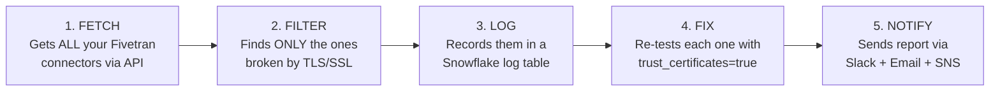

### Why This Matters for Your Business

| Without This Pipeline | With This Pipeline |
|---|---|
| Data outages go unnoticed for hours | Detected and fixed before business hours |
| Manual investigation takes 30-60 min per connector | Fully automated in under 5 minutes |
| No historical record of which connectors break | Complete audit trail with daily partitioning |
| Team finds out when dashboards are stale | Proactive notifications via 3 channels |
| Same connectors break repeatedly without tracking | Trend analysis possible via log table |

### How Long Does It Take?

The entire pipeline runs in **2-10 minutes** depending on how many connectors you have:

| Step | Typical Duration | Depends On |
|---|---|---|
| Fetch all connectors | 5-30 seconds | Number of connectors (API pagination) |
| Transform & filter | 2-5 seconds | Number of raw rows to process |
| MERGE into log | 1-2 seconds | Number of broken connectors found |
| Validate each connector | 3-10 seconds **per connector** | Fivetran API response time |
| Send notifications | 2-5 seconds | Network latency to Slack/SMTP/SNS |
| **Total (10 broken connectors)** | **~2-3 minutes** | |
| **Total (50 broken connectors)** | **~5-10 minutes** | |

### What This Pipeline Does NOT Do

It's important to understand the boundaries:

| This Pipeline Does | This Pipeline Does NOT |
|---|---|
| Detects TLS/SSL/certificate broken connectors | Fix broken connectors caused by expired passwords, OAuth tokens, or firewall changes |
| Applies `trust_certificates=true` fix | Modify connector configurations (host, port, database) |
| Logs everything in a Snowflake audit table | Send alerts for non-TLS issues (you'd need a separate pipeline) |
| Sends daily summary reports | Fix connectors where the source server is completely down |
| Tracks trends over time | Replace Fivetran's built-in monitoring (it supplements it) |

---

## 2. The Problem We're Solving

### What is TLS/SSL?

**TLS (Transport Layer Security)** and its predecessor **SSL (Secure Sockets Layer)** are security protocols that encrypt data traveling between two systems. When Fivetran connects to your database, it uses TLS to ensure:

1. **Privacy** — No one can eavesdrop on the data being synced
2. **Integrity** — No one can tamper with the data in transit
3. **Authentication** — Fivetran confirms it's talking to the real database, not an impersonator

### How TLS Works — The Handshake (Simplified)

Every time Fivetran connects to your database, a "TLS handshake" happens in milliseconds:

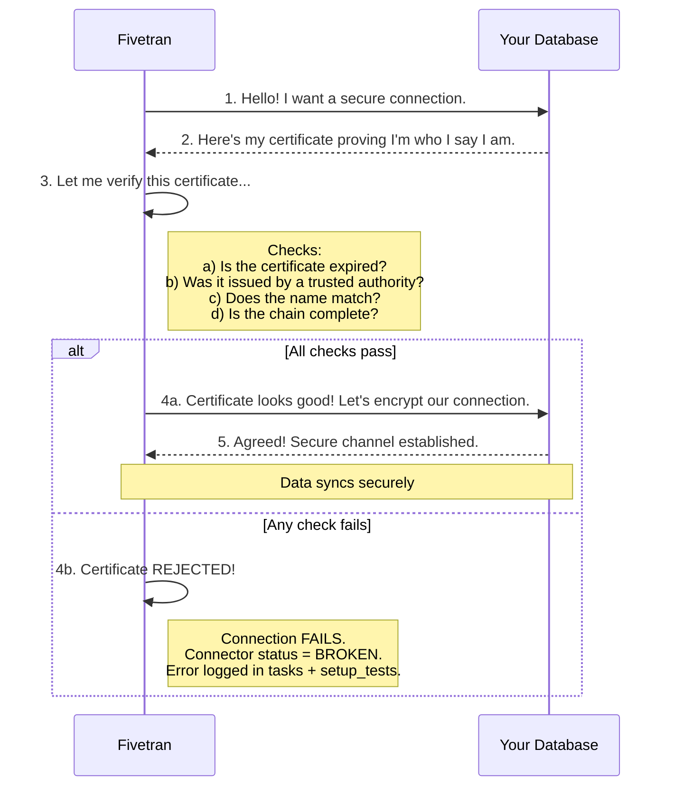

### How TLS Certificates Break Connections

TLS relies on **certificates** — digital documents that prove a server's identity (like a passport for computers). Connections break when:

| Failure Type | What Happened | How Common | Example Error Message |
|---|---|---|---|
| **Expired certificate** | The server's certificate passed its expiration date | Very common (certs expire every 90 days to 2 years) | `SSL certificate verify failed: certificate has expired` |
| **Self-signed certificate** | The certificate wasn't issued by a trusted authority (the server made its own) | Common for internal/dev servers | `certificate signed by unknown authority` |
| **Certificate chain broken** | An intermediate certificate is missing (like a broken link in a chain of trust) | Moderately common | `unable to get local issuer certificate` |
| **TLS version mismatch** | Server uses an older TLS version that Fivetran won't accept | Less common (TLS 1.0/1.1 deprecation) | `TLS handshake failed: protocol version not supported` |
| **Certificate authority not trusted** | The CA that issued the cert isn't in Fivetran's trust store | Common with private/corporate CAs | `the certificate authority is not trusted` |
| **Hostname mismatch** | The cert was issued for `db1.example.com` but you're connecting to `db2.example.com` | Occasional (DNS changes, load balancers) | `hostname verification failed` |

### Visual: What a Certificate Chain Looks Like

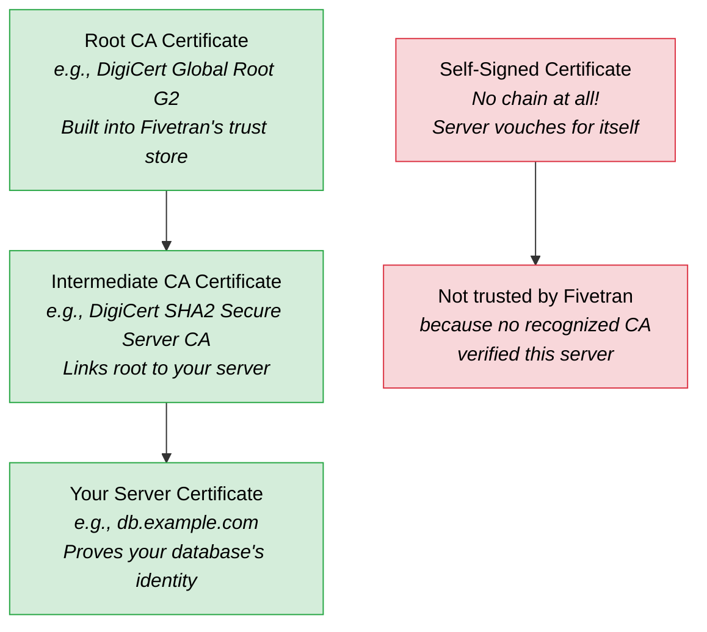

When ANY link in the chain is broken, expired, or unrecognized → **TLS handshake fails** → **connector breaks**.

### The Fix: `trust_certificates = true`

Fivetran provides a setting called `trust_certificates` on each connector. When set to `true`, it tells Fivetran:

> "I know this certificate might look unusual, but I trust this server. Go ahead and connect anyway."

This is safe for **internal databases** and **known servers** where you control the certificate. Our pipeline applies this fix automatically and records whether it worked.

### Why Not Just Set trust_certificates on Everything?

Good question! Because:
- New connectors are added regularly — each one starts without this setting
- Certificate issues come and go — a cert might be valid today and expire tomorrow
- Some broken connectors have **other problems** (like OAuth token expiry) — blindly setting trust_certificates won't help those
- You need an **audit trail** — when did it break, when was it fixed, did the fix work?

This pipeline handles all of that intelligently.

### Security Considerations — Is `trust_certificates` Safe?

This is an important question that security teams will ask. Here's the honest answer:

| Scenario | Is It Safe? | Why |
|---|---|---|
| **Internal databases** (your own servers with self-signed certs) | ✅ Yes | You know and control the server. The cert is "untrusted" only because you didn't pay a CA. |
| **Cloud databases** (RDS, Cloud SQL, Azure SQL) | ✅ Yes | Cloud providers use valid certs, but sometimes the chain isn't fully configured. |
| **SSH tunnel connections** | ✅ Yes | Traffic is already encrypted through the SSH tunnel. |
| **Public internet with unknown servers** | ⚠️ Caution | In theory, someone could impersonate the server (MITM attack). But Fivetran's connection is server-to-server, not browser-based, so risk is low. |
| **Compliance-regulated environments** (PCI, HIPAA, SOC 2) | ⚠️ Review | Some compliance frameworks require certificate validation. Check with your security team before enabling. |

**Bottom line:** For the vast majority of Fivetran connectors (especially to databases you own), `trust_certificates=true` is a safe and common configuration. The pipeline logs every action, so you have a full audit trail for compliance reviews.

### Common TLS Error Messages You'll See in the Log

Here are real error messages from Fivetran, grouped by root cause:

**Certificate Trust Issues:**
- `TLS certificate validation failed — the server certificate is not trusted by the client`
- `SSL certificate verify failed: unable to get local issuer certificate`
- `Certificate chain validation failed: self-signed certificate in certificate chain`
- `the certificate authority is not trusted`

**TLS Handshake Failures:**
- `SSL/TLS handshake failed: the certificate authority is not trusted`
- `TLS handshake error: certificate signed by unknown authority`
- `SSL handshake has read 0 bytes and written 0 bytes`

**Certificate Expiry:**
- `Server certificate expires in 3 days` (warning, not yet broken)
- `SSL certificate verify failed: certificate has expired`

---

## 3. Prerequisites & What You Need Before Starting

### Accounts & Access Required

| Requirement | Why You Need It | How to Get It |
|---|---|---|
| **Fivetran API Key + Secret** | To call the Fivetran REST API | Fivetran Dashboard → Settings → API Key → Generate |
| **Matillion DPC Account** | To run the pipelines | You already have this! |
| **Snowflake Warehouse** | To store log data | Your Matillion environment connects to this |
| **Slack Webhook URL** | For Slack notifications | Slack → Apps → Incoming Webhooks → Create |
| **SMTP Email Credentials** | For email notifications | Your email provider (Gmail, SendGrid, etc.) |
| **AWS SNS Topic ARN** | For AWS push notifications | AWS Console → SNS → Create Topic |

> **Note:** Notifications are independent — if you don't have Slack, email still works. If you don't have AWS, the other two still work. The pipeline uses `unconditional` transitions so one failing notification doesn't block the others.

### Fivetran API Key — How to Generate

1. Log into **Fivetran Dashboard** (https://fivetran.com/dashboard)
2. Click your **profile icon** (top right) → **API Key**
3. Click **Generate API Key**
4. You'll get two values:
   - **API Key** (this is your username for Basic Auth)
   - **API Secret** (this is your password for Basic Auth)
5. **Save both** — the secret is only shown once!
6. In Matillion, store the API Secret as a **secret reference** (never paste it directly into a pipeline)

### Matillion Secrets — How to Create

Secrets in Matillion are stored securely and referenced by name. You'll need:

| Secret Name | What It Stores | Used By |
|---|---|---|
| `smtp_password_secret` | Your SMTP email password | Send Email Report component |
| `fivetran_api_secret` | Your Fivetran API Secret | Custom Connector authentication |

To create a secret:
1. In Matillion DPC, go to **Secrets Management**
2. Click **Add Secret**
3. Enter the **name** (e.g., `smtp_password_secret`)
4. Enter the **value** (your actual password — Matillion encrypts this)
5. Save — now you reference it by name in pipelines

### Files in This Project

| File | Type | Purpose | Components |
|---|---|---|---|
| `fivetran_tls_daily_fix.orch.yaml` | Orchestration | Main pipeline — the coordinator | 12 |
| `fivetran_tls_transform.tran.yaml` | Transformation | Data processing — filter & enrich | 6 |
| `Validate_TLS_Connection.orch.yaml` | Orchestration | Sub-pipeline — tests one connector | 4 |
| `docs/Daily_Fivetran_TLS_Fix_Blueprint.md` | Documentation | This file! | N/A |

### Pre-Flight Checklist

Before your first run, verify each item:

- [ ] Fivetran API Key + Secret generated and saved
- [ ] `fivetran_api_secret` secret created in Matillion
- [ ] `smtp_password_secret` secret created in Matillion
- [ ] Custom Connector created in Matillion UI (replaces SQL placeholder)
- [ ] `slack_webhook_url` variable updated with your Slack webhook
- [ ] `email_recipient` variable updated with your email address
- [ ] `email_sender` and `smtp_username` variables configured
- [ ] `smtp_hostname` variable set to your SMTP server
- [ ] AWS SNS topic created (or SNS component skipped if not using AWS)
- [ ] Snowflake role has CREATE TABLE, INSERT, UPDATE, DROP TABLE permissions
- [ ] Pipeline schedule created (Daily at 9:30 PM UTC / 3:00 AM IST)
- [ ] Test run completed successfully

### Snowflake Permissions Required

The Matillion environment's Snowflake role needs these permissions on the target schema:

```sql
-- Grant these to your Matillion role (replace MATILLION_ROLE and schema as needed)
GRANT CREATE TABLE ON SCHEMA "YOUR_DB"."PUBLIC" TO ROLE "MATILLION_ROLE";
GRANT INSERT, UPDATE, DELETE, SELECT ON ALL TABLES IN SCHEMA "YOUR_DB"."PUBLIC" TO ROLE "MATILLION_ROLE";
GRANT INSERT, UPDATE, DELETE, SELECT ON FUTURE TABLES IN SCHEMA "YOUR_DB"."PUBLIC" TO ROLE "MATILLION_ROLE";
```

**Specific tables the pipeline creates/uses:**

| Table | Created By | Lifetime | Operations Performed |
|---|---|---|---|
| `RAW_FIVETRAN_CONNECTIONS` | Custom Connector (Component 3) | Temporary (dropped at end) | CREATE, INSERT, SELECT, DROP |
| `FIVETRAN_TLS_BROKEN_STAGING` | Rewrite Table (Component 18) | Temporary (dropped at end) | CREATE, INSERT, SELECT, DROP |
| `FIVETRAN_TLS_BROKEN_LOG` | Create Table v2 (Component 2) | Permanent (keeps history) | CREATE IF NOT EXISTS, SELECT, INSERT (via MERGE), UPDATE |

### Network Requirements

The Matillion environment needs outbound access to:

| Destination | Port | Protocol | Purpose |
|---|---|---|---|
| `api.fivetran.com` | 443 | HTTPS | Fivetran REST API calls |
| Your SMTP server (e.g., `smtp.gmail.com`) | 587 | SMTP/TLS | Sending email notifications |
| Your Slack webhook URL | 443 | HTTPS | Slack notifications |
| AWS SNS endpoint (e.g., `sns.us-east-1.amazonaws.com`) | 443 | HTTPS | SNS notifications |

---

## 4. Understanding the Fivetran API

### Why Do We Need the API?

The Fivetran dashboard shows you connector statuses, but it's designed for humans clicking buttons. To **automate** checking hundreds of connectors, we need the **Fivetran REST API** — a programmatic interface that lets our pipeline ask Fivetran questions and perform actions.

### API Basics for Non-Developers

Think of an API like a restaurant:
- **You (the pipeline)** are the customer
- **The API** is the waiter
- **Fivetran's servers** are the kitchen

You don't go into the kitchen yourself. You tell the waiter (API) what you want, and they bring it back.

| Concept | Restaurant Analogy | API Equivalent |
|---|---|---|
| **Endpoint** | Menu item | URL path (e.g., `/v1/connectors`) |
| **Method** | How you order (dine-in vs takeout) | GET (read data) or POST (send data) |
| **Authentication** | Showing your reservation | API Key + Secret (Basic Auth) |
| **Request** | Your order | HTTP request with parameters |
| **Response** | Your food | JSON data with results |
| **Pagination** | "We'll bring your courses one at a time" | Cursor-based (get page 1, then page 2...) |

### Endpoint 1: GET /v1/connectors (Fetch All Connections)

**What it does:** Returns a list of ALL your Fivetran connectors with their current status.

**URL:** `https://api.fivetran.com/v1/connectors`
**Method:** GET (reading data, not changing anything)
**Authentication:** HTTP Basic Auth
- Username = Your Fivetran API Key
- Password = Your Fivetran API Secret

**Pagination Explained:**
If you have 500 connectors, Fivetran doesn't send all 500 at once (that would be slow). Instead:

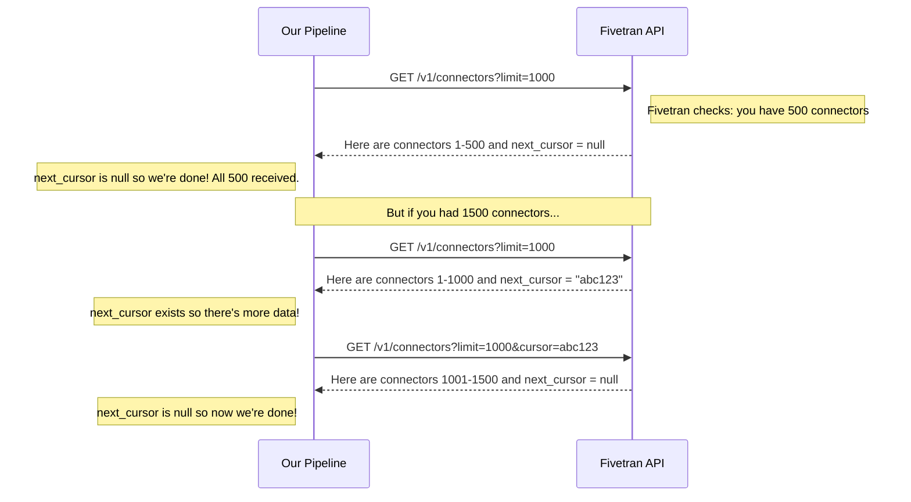

### The Response Structure — Every Field Explained

When the API responds, it sends back JSON (a structured data format). Here's what every field means:

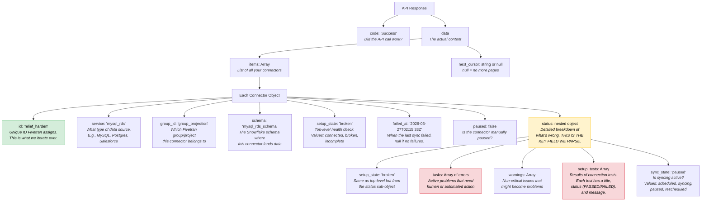

### Real Sample Response (4 Connectors)

Below is a realistic API response based on the official Fivetran documentation. We use these 4 connectors throughout this entire blueprint to show exactly how data flows through every component:

| # | Connector ID | Service | Status | Problem | TLS Related? |
|---|---|---|---|---|---|
| 1 | `relief_harden` | mysql_rds | broken | TLS certificate validation failed | **YES** |
| 2 | `liquid_drop` | postgres_rds | connected | No problems | No |
| 3 | `warm_feather` | sql_server_rds | broken | SSL/TLS handshake failed | **YES** |
| 4 | `bright_storm` | google_analytics | broken | OAuth token expired | **No** (different problem) |

> **Key insight:** 3 out of 4 are broken, but only 2 are broken because of TLS. `bright_storm` is broken for a completely different reason (OAuth). Our filter must correctly **include** `relief_harden` and `warm_feather` while **excluding** `bright_storm`.

<details>
<summary><b>Click to see the full JSON response</b></summary>

```json
{
  "code": "Success",
  "data": {
    "items": [
      {
        "id": "relief_harden",
        "service": "mysql_rds",
        "group_id": "group_projection",
        "schema": "mysql_rds_schema",
        "connected_by": "concerning_gate",
        "created_at": "2024-03-15T10:22:00.000Z",
        "succeeded_at": null,
        "failed_at": "2026-03-27T02:15:33.000Z",
        "paused": false,
        "setup_state": "broken",
        "config": {
          "host": "db.example.com",
          "port": 3306,
          "database": "production",
          "user": "fivetran_user"
        },
        "status": {
          "setup_state": "broken",
          "sync_state": "paused",
          "update_state": "delayed",
          "is_historical_sync": false,
          "tasks": [
            {
              "code": "reconnect",
              "message": "Connection to source failed: TLS certificate validation failed — the server certificate is not trusted by the client"
            }
          ],
          "warnings": [],
          "setup_tests": [
            {
              "title": "Connecting to SSH tunnel",
              "status": "PASSED",
              "message": ""
            },
            {
              "title": "Connecting to host",
              "status": "FAILED",
              "message": "SSL certificate verify failed: unable to get local issuer certificate"
            },
            {
              "title": "Validating certificate",
              "status": "FAILED",
              "message": "Certificate chain validation failed: self-signed certificate in certificate chain"
            }
          ]
        }
      },
      {
        "id": "liquid_drop",
        "service": "postgres_rds",
        "group_id": "group_projection",
        "schema": "postgres_schema",
        "connected_by": "concerning_gate",
        "created_at": "2024-06-01T08:00:00.000Z",
        "succeeded_at": "2026-03-27T01:00:00.000Z",
        "failed_at": null,
        "paused": false,
        "setup_state": "connected",
        "status": {
          "setup_state": "connected",
          "sync_state": "scheduled",
          "update_state": "on_schedule",
          "is_historical_sync": false,
          "tasks": [],
          "warnings": [],
          "setup_tests": [
            {
              "title": "Connecting to host",
              "status": "PASSED",
              "message": ""
            }
          ]
        }
      },
      {
        "id": "warm_feather",
        "service": "sql_server_rds",
        "group_id": "group_projection",
        "schema": "sqlserver_schema",
        "connected_by": "concerning_gate",
        "created_at": "2025-01-10T14:30:00.000Z",
        "succeeded_at": null,
        "failed_at": "2026-03-27T02:45:00.000Z",
        "paused": false,
        "setup_state": "broken",
        "status": {
          "setup_state": "broken",
          "sync_state": "paused",
          "update_state": "delayed",
          "is_historical_sync": false,
          "tasks": [
            {
              "code": "reconnect",
              "message": "SSL/TLS handshake failed: the certificate authority is not trusted"
            }
          ],
          "warnings": [
            {
              "code": "cert_expiry",
              "message": "Server certificate expires in 3 days"
            }
          ],
          "setup_tests": [
            {
              "title": "Connecting to host",
              "status": "FAILED",
              "message": "TLS handshake error: certificate signed by unknown authority"
            }
          ]
        }
      },
      {
        "id": "bright_storm",
        "service": "google_analytics",
        "group_id": "group_analytics",
        "schema": "ga4_schema",
        "connected_by": "concerning_gate",
        "created_at": "2025-06-20T09:00:00.000Z",
        "succeeded_at": null,
        "failed_at": "2026-03-27T03:00:00.000Z",
        "paused": false,
        "setup_state": "broken",
        "status": {
          "setup_state": "broken",
          "sync_state": "paused",
          "update_state": "delayed",
          "is_historical_sync": false,
          "tasks": [
            {
              "code": "reconnect",
              "message": "OAuth token expired. Please re-authenticate."
            }
          ],
          "warnings": [],
          "setup_tests": [
            {
              "title": "Authenticating",
              "status": "FAILED",
              "message": "Invalid credentials"
            }
          ]
        }
      }
    ],
    "next_cursor": null
  }
}
```

</details>

### Endpoint 2: POST /v1/connectors/{connector_id}/test (Test Connection)

**What it does:** Tells Fivetran to re-test a specific connector's connection, optionally with `trust_certificates=true`.

**URL:** `https://api.fivetran.com/v1/connectors/{connector_id}/test`
**Method:** POST (performing an action)
**Authentication:** Same Basic Auth as above

**Request Body:**
```json
{
  "trust_certificates": true,
  "trust_fingerprints": true
}
```

**What `trust_certificates: true` Does:**
Tells Fivetran to accept the server's TLS certificate even if it's:
- Self-signed (not from a recognized authority)
- From an unknown certificate authority
- Part of an incomplete certificate chain

**What `trust_fingerprints: true` Does:**
Tells Fivetran to accept the server's SSH host key fingerprint. Useful when connecting through SSH tunnels.

**Response on Success (HTTP 200):**
```json
{"code": "Success", "message": "Connector has been tested successfully"}
```

**Response on Failure (HTTP 400/500):**
```json
{"code": "Error", "message": "Connection test failed: host unreachable"}
```

### API Rate Limits

Fivetran has API rate limits to prevent abuse:

| Limit Type | Value | What It Means |
|---|---|---|
| **Requests per minute** | 100 requests/min | You can make 100 API calls per minute |
| **Connector test requests** | Lower limit | Testing connectors is more resource-intensive |

**How our pipeline handles this:**
- The Table Iterator runs **sequentially** (one connector at a time), not in parallel
- Each validation takes 3-10 seconds, so even 50 connectors = ~50 requests over 5 minutes = well within limits
- The Custom Connector handles pagination automatically, staying within limits

### API Error Codes Reference

| HTTP Status | Meaning | What Our Pipeline Does |
|---|---|---|
| `200 OK` | Request succeeded | Processes the response data |
| `400 Bad Request` | Invalid request format | Webhook POST follows `failure` transition |
| `401 Unauthorized` | Invalid API credentials | Pipeline fails at Fetch step (check your API key/secret) |
| `403 Forbidden` | API key doesn't have permission | Pipeline fails (check Fivetran role permissions) |
| `404 Not Found` | Connector ID doesn't exist | Webhook POST follows `failure` transition |
| `429 Too Many Requests` | Rate limit exceeded | Retry after waiting (Custom Connector handles this) |
| `500 Internal Server Error` | Fivetran server issue | Pipeline fails (temporary — retry later) |

### Understanding HTTP Basic Auth

Basic Authentication works like this:

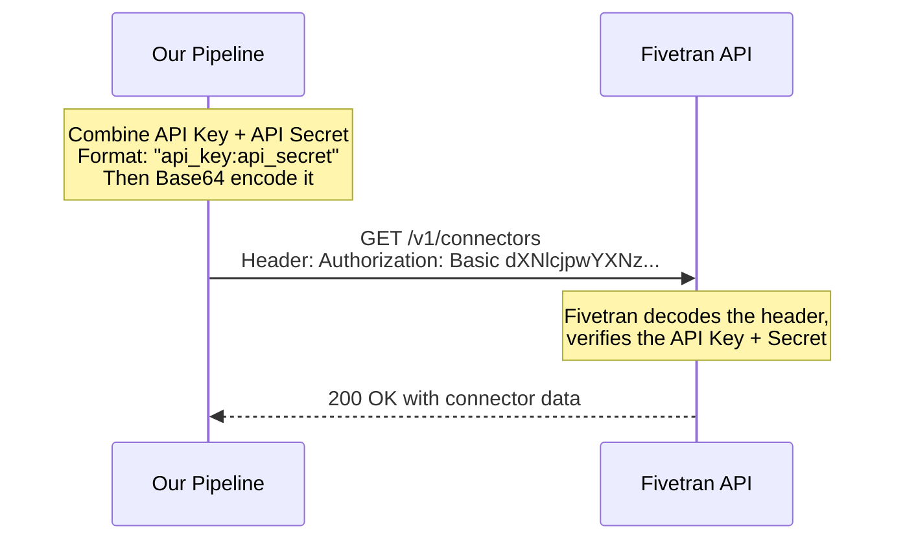

You don't need to do any of this manually — the Custom Connector component handles encoding and sending the auth header automatically. You just provide the API Key and Secret reference.

---

## 5. Architecture Overview

### How the 3 Pipelines Work Together

This system uses **3 separate pipeline files** that call each other. Think of it like a company org chart:

- **Main Orchestration** = The CEO — coordinates everything, decides what happens next
- **Transformation** = The Analyst — processes and filters the raw data
- **Validation Sub-Orchestration** = The Technician — tests one connector at a time

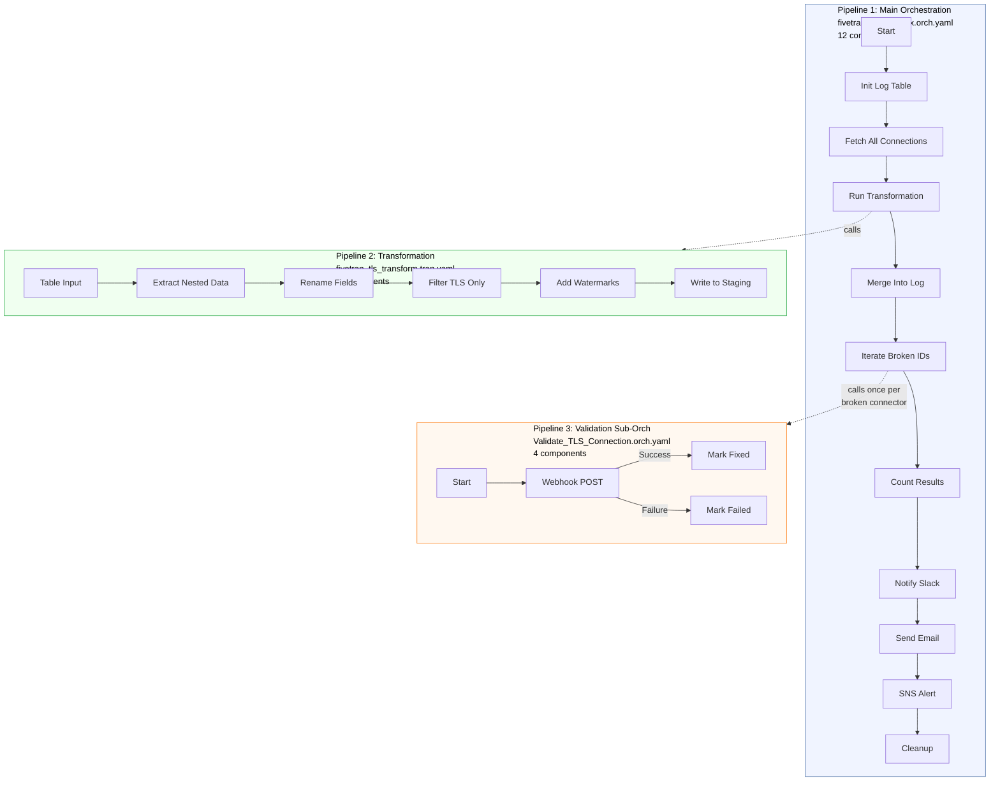

### Why 3 Pipelines Instead of 1?

| Reason | Explanation |
|---|---|
| **Separation of concerns** | Each pipeline has one job. Easier to debug, test, and modify independently. |
| **Orchestration vs Transformation** | Matillion enforces this separation. Orchestration = control flow (do this, then that). Transformation = data processing (filter, calculate, join). They can't be mixed. |
| **Iteration pattern** | The Table Iterator component needs a separate sub-pipeline to call for each row. That's the Validation pipeline. |
| **Reusability** | The validation sub-pipeline could be called from other pipelines too. |

### What Touches What — External Services & Tables

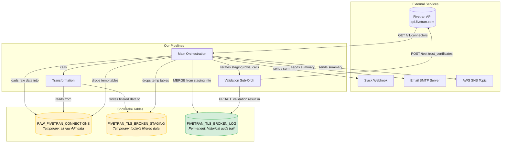

### Understanding Transition Types

In orchestration pipelines, components are connected by **transitions** — arrows that control the flow. There are different types:

| Transition Type | When It Fires | Icon | Used For |
|---|---|---|---|
| `unconditional` | **Always** — whether the previous component succeeded, failed, or errored | ➔ | Start → next step, notification chains (proceed even if notification fails) |
| `success` | **Only if** the previous component completed without errors | ✔️➔ | Most transitions — only proceed if the step worked |
| `failure` | **Only if** the previous component errored | ❌➔ | Error handling branches (e.g., Test Connection → Mark as Failed) |

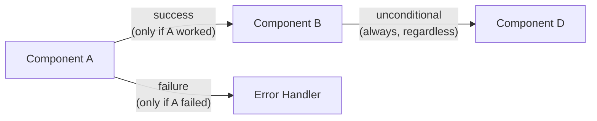

**In our pipeline:**
- Most transitions are `success` — "only proceed if the last step worked"
- Notification transitions are `unconditional` — "send the next notification even if the previous one failed"
- Validation uses `success`/`failure` branching — "if Fivetran test passed, mark fixed; if it failed, mark failed"

### Understanding Orchestration vs. Transformation

| Aspect | Orchestration (.orch.yaml) | Transformation (.tran.yaml) |
|---|---|---|
| **Purpose** | Control flow — "do this, then that" | Data processing — "transform this data" |
| **Components** | SQL Executor, Create Table, API calls, notifications, iterators | Table Input, Filter, Calculator, Join, Aggregate, Output |
| **Connections** | Transitions (arrows with conditions) | Sources (data flows from one component to the next) |
| **Execution** | Sequential, one component at a time (unless parallel branches) | Compiled into a single SQL query (Snowflake executes it all at once) |
| **Can call** | Other orchestrations AND transformations | Nothing — transformations are "leaf nodes" |
| **Variables** | Can SET and GET variables | Can only READ variables |
| **Analogy** | A project manager giving instructions | An assembly line processing materials |

### Complete Component Inventory (All 22)

| # | Component Name | Component Type | Pipeline | What It Does (Plain English) |
|---|---|---|---|---|
| 1 | Start | `start` | Main Orch | Entry point — every orchestration begins here |
| 2 | Init Log Table | `create-table-v2` | Main Orch | Creates the log table if it doesn't already exist (first run only) |
| 3 | Fetch All Connections | `sql-executor`* | Main Orch | Calls Fivetran API to get all connectors (*placeholder for Custom Connector) |
| 4 | Transform and Filter | `run-transformation` | Main Orch | Calls Pipeline 2 to process the raw data |
| 5 | Merge Into Log | `sql-executor` | Main Orch | Inserts today's broken connectors into the permanent log (no duplicates) |
| 6 | Iterate Broken IDs | `table-iterator` | Main Orch | Loops through each broken connector, one at a time |
| 7 | Validate Connection | `run-orchestration` | Main Orch | Calls Pipeline 3 for each broken connector |
| 8 | Count Results | `sql-executor` | Main Orch | Counts how many were fixed vs. still failing |
| 9 | Notify Slack | `webhook-post` | Main Orch | Sends summary to a Slack channel |
| 10 | Send Email Report | `send-email-v2` | Main Orch | Sends summary via email |
| 11 | SNS Alert | `sns-message` | Main Orch | Sends summary to AWS SNS topic |
| 12 | Cleanup Staging | `sql-executor` | Main Orch | Drops temporary tables to keep warehouse clean |
| 13 | Load Raw Connections | `table-input` | Transform | Reads the raw API data from Snowflake |
| 14 | Extract Status Fields | `extract-nested-data-sf` | Transform | Unpacks the nested JSON `status` object into separate columns |
| 15 | Rename Connector Fields | `calculator` | Transform | Renames columns to match our log table schema |
| 16 | Filter TLS Broken Only | `filter` | Transform | Keeps ONLY connectors broken due to TLS/SSL/certificate issues |
| 17 | Add Watermark Columns | `calculator` | Transform | Adds today's date and exact timestamp for daily partitioning |
| 18 | Write to Staging | `rewrite-table` | Transform | Writes the filtered results to a staging table |
| 19 | Start | `start` | Validate | Entry point for the sub-pipeline |
| 20 | Test Connection | `webhook-post` | Validate | POSTs to Fivetran's test API with trust_certificates=true |
| 21 | Mark as Fixed | `sql-executor` | Validate | Updates the log: this connector was fixed! |
| 22 | Mark as Failed | `sql-executor` | Validate | Updates the log: this connector is still broken |

---

## 6. Pipeline 1: Main Orchestration (The Brain)

**File:** `fivetran_tls_daily_fix.orch.yaml`
**Components:** 12 | **Variables:** 13
**Purpose:** Coordinates the entire daily process from start to finish.

### What is an Orchestration Pipeline?

An **orchestration pipeline** is like a project manager — it doesn't do the data processing itself, but it tells other things what to do and in what order. It can:
- Create/modify database tables
- Call transformation pipelines
- Call other orchestration pipelines
- Run SQL commands
- Send notifications
- Loop through data

Components in an orchestration are connected by **transitions** — arrows that say "after this succeeds, do that next."

### Visual Flow with Explanations

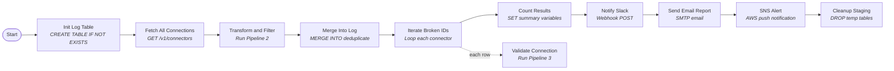

### Component-by-Component Deep Dive

#### Component 1: Start
- **Type:** `start`
- **What it does:** Every orchestration pipeline must have exactly one Start component. It's the entry point — when the pipeline is triggered (manually or by schedule), execution begins here.
- **Transition:** `unconditional` → Init Log Table (always proceeds, no conditions)

#### Component 2: Init Log Table
- **Type:** `create-table-v2` ([Documentation](https://docs.matillion.com/data-productivity-cloud/designer/docs/create-table-v2/))
- **What it does:** Creates the `FIVETRAN_TLS_BROKEN_LOG` table in Snowflake. Uses `Create If Not Exists` so it only creates the table on the very first run. On subsequent runs, it sees the table already exists and moves on instantly.
- **Why this is important:** Without this, the first run would fail when trying to MERGE into a non-existent table. By making table creation the first step, the pipeline is **self-initializing** — you can deploy it to a new environment and it sets itself up.

**Key Parameters:**

| Parameter | Value | Why This Value |
|---|---|---|
| `createMethod` | `Create If Not Exists` | Only creates on first run; does nothing on subsequent runs |
| `database` | `[Environment Default]` | Uses the environment's configured database (flexible across envs) |
| `schema` | `[Environment Default]` | Same — adapts to whatever schema the environment uses |
| `table` | `FIVETRAN_TLS_BROKEN_LOG` | Descriptive name indicating purpose |
| `snowflakeTableType` | `Permanent` | Data persists across sessions (not temporary) |
| `comment` | `"Historical log of Fivetran connectors broken due to TLS/SSL/certificate issues"` | Self-documenting — shows in Snowflake's SHOW TABLES |

**Table created:** 16 columns (see Section 11 for full schema with every column explained)

**What `[Environment Default]` means:**
In Matillion, each environment has a configured Snowflake database and schema. Using `[Environment Default]` means the pipeline automatically uses the right database/schema for whatever environment it runs in (dev, staging, production). You don't need to hard-code database names.

- **Transition:** `success` → Fetch All Connections

#### Component 3: Fetch All Connections
- **Type:** `sql-executor` (PLACEHOLDER — replace with Custom Connector)
- **What it does currently:** Creates an empty `RAW_FIVETRAN_CONNECTIONS` table as a placeholder.
- **What it SHOULD do:** Call Fivetran's GET /v1/connectors API with cursor pagination and load all connectors into `RAW_FIVETRAN_CONNECTIONS`.
- **Action required:** Create a Custom Connector in the Matillion UI (see Section 13 for instructions).
- **Transition:** `success` → Transform and Filter

#### Component 4: Transform and Filter
- **Type:** `run-transformation`
- **What it does:** Calls Pipeline 2 (`fivetran_tls_transform.tran.yaml`). This is where the raw API data gets processed:
  1. Nested JSON gets unpacked
  2. Columns get renamed
  3. Non-TLS connectors get filtered out
  4. Watermark timestamps get added
  5. Results get written to staging
- **Why a separate pipeline?** Transformations (data processing) must happen in transformation pipelines. Orchestrations coordinate but don't transform data.
- **Transition:** `success` → Merge Into Log

#### Component 5: Merge Into Log
- **Type:** `sql-executor`
- **What it does:** Runs a MERGE INTO statement that:
  1. Compares staging data against the log table
  2. Matches on `BROKEN_ID + CHECK_DATE` (same connector + same day)
  3. If no match exists → INSERT the new row
  4. If match exists → SKIP (prevents duplicates if pipeline re-runs)

**The actual SQL:**
```sql
MERGE INTO FIVETRAN_TLS_BROKEN_LOG AS tgt
USING FIVETRAN_TLS_BROKEN_STAGING AS src
ON tgt.BROKEN_ID = src.BROKEN_ID AND tgt.CHECK_DATE = src.CHECK_DATE
WHEN NOT MATCHED THEN INSERT (
    BROKEN_ID, CONNECTOR_SERVICE, GROUP_ID, CONNECTOR_SCHEMA,
    LAST_FAILED_AT, CONNECTOR_SETUP_STATE, STATUS_SETUP_STATE,
    SETUP_TESTS, STATUS_TASKS, STATUS_WARNINGS, ERROR_REASON,
    CHECK_DATE, WATERMARK_DATE, VALIDATION_STATUS
) VALUES (
    src.BROKEN_ID, src.CONNECTOR_SERVICE, src.GROUP_ID, src.CONNECTOR_SCHEMA,
    src.LAST_FAILED_AT, src.CONNECTOR_SETUP_STATE, src.STATUS_SETUP_STATE,
    src.SETUP_TESTS, src.STATUS_TASKS, src.STATUS_WARNINGS, src.ERROR_REASON,
    src.CHECK_DATE, src.WATERMARK_DATE, src.VALIDATION_STATUS
);
```

**Why MERGE instead of INSERT?**
If the pipeline runs twice in one day (e.g., you trigger it manually after the scheduled run), a plain INSERT would create duplicate rows. MERGE checks "does this connector + date already exist?" and only inserts if it's new.

- **Transition:** `success` → Iterate Broken IDs

#### Component 6: Iterate Broken IDs
- **Type:** `table-iterator`
- **What it does:** This is the loop mechanism. It:
  1. Reads from `FIVETRAN_TLS_BROKEN_STAGING`
  2. For each row, maps column values to pipeline variables:
     - `BROKEN_ID` column → `broken_connector_id` variable
     - `CONNECTOR_SERVICE` column → `broken_connector_name` variable
  3. Calls the **iteration target** (Validate Connection) once per row
  4. After all rows are processed, follows the `success` transition

**Configuration details:**

| Parameter | Value | Why This Value |
|---|---|---|
| `mode` | `Basic` | Simple row-by-row iteration (vs. Advanced with custom SQL) |
| `database` | `[Environment Default]` | Reads from the environment's database |
| `schema` | `[Environment Default]` | Reads from the environment's schema |
| `targetTable` | `FIVETRAN_TLS_BROKEN_STAGING` | The filtered table from transformation |
| `concurrency` | `Sequential` | One at a time (safer for API rate limits; avoids overwhelming Fivetran) |
| `sort` | `Ascending` | Processes connectors in alphabetical order (consistent, predictable) |
| `breakOnFailure` | `No` | If connector A's validation fails, still validate connector B, C, etc. |

**Column Mapping — How Table Columns Become Variables:**

| Table Column | → Maps To Variable | Variable Type | Why |
|---|---|---|---|
| `BROKEN_ID` | `broken_connector_id` | TEXT (COPIED) | Used in webhook URL: `.../connectors/${broken_connector_id}/test` |
| `CONNECTOR_SERVICE` | `broken_connector_name` | TEXT (COPIED) | Used in logging for human-readable identification |

**Sequential vs. Concurrent Execution:**

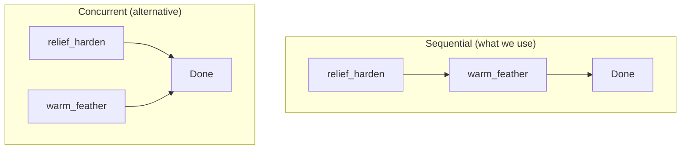

We use **Sequential** because:
1. **API rate limits** — Fivetran's test endpoint has lower rate limits
2. **Simpler debugging** — if something fails, you know exactly which connector caused it
3. **Variable safety** — COPIED scope prevents race conditions, but sequential is still cleaner

- **Iteration target:** Validate Connection (Component 7)
- **Transition after all iterations:** `success` → Count Results

#### Component 7: Validate Connection
- **Type:** `run-orchestration`
- **What it does:** Calls Pipeline 3 (`Validate_TLS_Connection.orch.yaml`), passing the current connector's ID and name as variable overrides.
- **Variable passing:**
  - `broken_connector_id` = `${broken_connector_id}` (current value from iterator)
  - `broken_connector_name` = `${broken_connector_name}` (current value from iterator)
- **This component has no transitions** — it's an iteration target, controlled by the iterator.

#### Component 8: Count Results
- **Type:** `sql-executor`
- **What it does:** After all validations are done, counts the results and stores them in pipeline variables for the notification messages.

**The SQL:**
```sql
SET total_broken = (SELECT COUNT(*) FROM FIVETRAN_TLS_BROKEN_LOG
                    WHERE CHECK_DATE = CURRENT_DATE());
SET total_fixed = (SELECT COUNT(*) FROM FIVETRAN_TLS_BROKEN_LOG
                   WHERE CHECK_DATE = CURRENT_DATE()
                   AND VALIDATION_STATUS = 'success');
SET total_failed = (SELECT COUNT(*) FROM FIVETRAN_TLS_BROKEN_LOG
                    WHERE CHECK_DATE = CURRENT_DATE()
                    AND VALIDATION_STATUS = 'failed');
SET total_pending = (SELECT COUNT(*) FROM FIVETRAN_TLS_BROKEN_LOG
                     WHERE CHECK_DATE = CURRENT_DATE()
                     AND VALIDATION_STATUS = 'pending');
SET check_date = (SELECT CURRENT_DATE()::VARCHAR);
```

- **Transition:** `success` → Notify Slack

#### Component 9: Notify Slack
- **Type:** `webhook-post`
- **What it does:** Sends a formatted message to a Slack channel via an incoming webhook URL.
- **Webhook URL:** `${slack_webhook_url}` (pipeline variable — configure with your Slack webhook)
- **Payload:** A JSON message with emoji and Markdown formatting that Slack renders nicely:
  ```json
  {"text": ":wrench: *Daily Fivetran TLS Fix Report*\nDate: ${check_date}\nTotal broken: ${total_broken}\nFixed: ${total_fixed}\nStill failing: ${total_failed}\nPending: ${total_pending}"}
  ```
- **Transition:** `unconditional` → Send Email Report
  - **Why unconditional?** Even if Slack fails (wrong URL, Slack is down), we still want to send the email. `unconditional` means "proceed regardless of success or failure."

#### Component 10: Send Email Report
- **Type:** `send-email-v2`
- **What it does:** Sends an email via SMTP with the daily summary.
- **Configuration:**
  - To: `${email_recipient}` (e.g., `admin@inupup.com`)
  - From: `${email_sender}` (e.g., `noreply@inupup.com`)
  - Subject: `Daily Fivetran TLS Fix Report - ${check_date}`
  - SMTP Host: `${smtp_hostname}` (e.g., `smtp.gmail.com`)
  - SMTP Port: 587 (standard TLS port)
  - Password: `smtp_password_secret` (a Matillion secret reference, NOT the actual password)
  - SSL/TLS: Enabled
  - StartTLS: Enabled
- **Transition:** `unconditional` → SNS Alert (same reason — graceful degradation)

#### Component 11: SNS Alert
- **Type:** `sns-message`
- **What it does:** Publishes a message to an AWS SNS topic. SNS can then fan out to:
  - SMS text messages
  - Push notifications
  - Lambda functions
  - SQS queues
  - Other subscribers
- **Configuration:**
  - Region: `us-east-1` (change to your region)
  - Topic: `fivetran-tls-fix-alerts`
  - Subject: `Fivetran TLS Fix - ${check_date}`
  - Message: `Broken: ${total_broken} | Fixed: ${total_fixed} | Failed: ${total_failed} | Pending: ${total_pending}`
- **Transition:** `success` → Cleanup Staging

#### Component 12: Cleanup Staging
- **Type:** `sql-executor`
- **What it does:** Drops the temporary tables that were only needed during this run:
  ```sql
  DROP TABLE IF EXISTS RAW_FIVETRAN_CONNECTIONS;
  DROP TABLE IF EXISTS FIVETRAN_TLS_BROKEN_STAGING;
  ```
- **Why clean up?** These tables contain a snapshot of data at one point in time. Tomorrow's run will create fresh ones. Keeping them wastes storage and could cause confusion.
- **This is the final component** — no outgoing transition.

---

## 7. Pipeline 2: Transformation (The Filter)

**File:** `fivetran_tls_transform.tran.yaml`
**Components:** 6 | **Variables:** None (inherits context from the calling orchestration)
**Purpose:** Takes raw API data, extracts nested fields, filters for TLS issues, adds timestamps.

### What is a Transformation Pipeline?

A **transformation pipeline** processes data that's already in Snowflake. It reads from tables, applies operations (filter, calculate, join, aggregate), and writes results to new tables. Think of it as an assembly line:

```
Raw materials (table) → Step 1 → Step 2 → Step 3 → Finished product (new table)
```

Unlike orchestration pipelines (which use transitions/arrows), transformation components are connected via **sources** — each component says "I get my data from this other component."

**Important concept — Transformations compile to SQL:**
When Matillion runs a transformation pipeline, it doesn't execute each component separately. Instead, it **compiles the entire chain into a single SQL query** and sends it to Snowflake. This means:
- All 6 components in our transformation become one efficient SQL statement
- Snowflake optimizes the query plan internally
- There's no round-trip between Matillion and Snowflake for each component
- The intermediate states shown in Section 9 are conceptual — Snowflake processes them as one operation

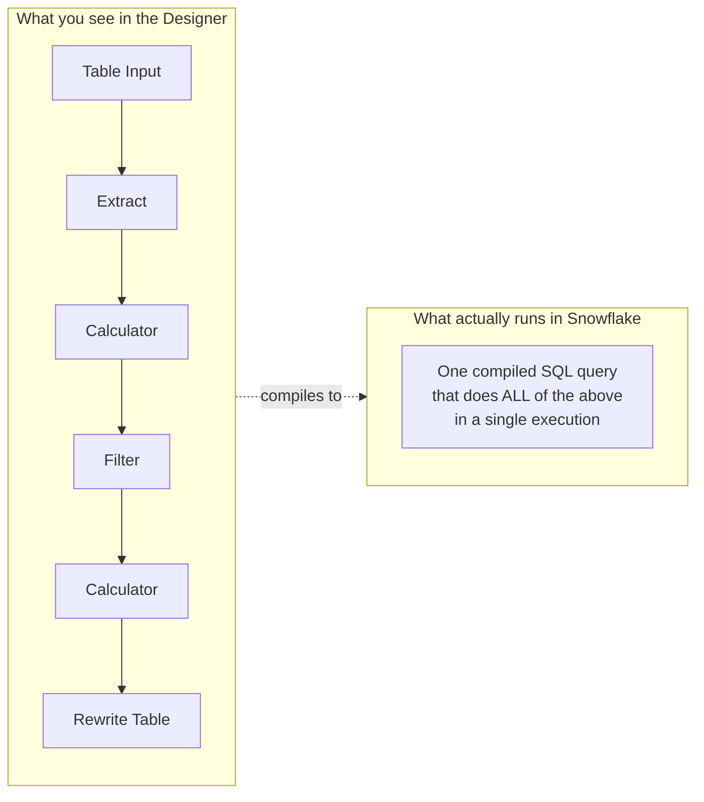

### Component-by-Component Deep Dive

#### Component 13: Load Raw Connections
- **Type:** `table-input`
- **What it does:** Reads data from the `RAW_FIVETRAN_CONNECTIONS` table. This is the starting point of the transformation — the raw API data that was loaded by the Custom Connector.
- **Columns selected:** `id`, `service`, `group_id`, `schema`, `connected_by`, `created_at`, `failed_at`, `paused`, `setup_state`, `status`, `config`
- **Why select specific columns?** The API might return more fields than we need. Selecting only what we use keeps things efficient.

#### Component 14: Extract Status Fields
- **Type:** `extract-nested-data-sf`
- **What it does:** This is one of the most important components. The `status` column contains a **nested JSON object** (a VARIANT type in Snowflake). We can't filter on fields inside a JSON blob directly with simple components — we need to "unpack" them into regular columns first.

**Before Extract Nested Data:**
| id | status |
|---|---|
| relief_harden | `{"setup_state":"broken","tasks":[{"message":"TLS certificate..."}],...}` |

**After Extract Nested Data:**
| id | status | STATUS_SETUP_STATE | STATUS_TASKS | STATUS_WARNINGS | SETUP_TESTS |
|---|---|---|---|---|---|
| relief_harden | `{...}` | broken | `[{"message":"TLS certificate..."}]` | `[]` | `[{"title":"Connecting..."}]` |

**Field mapping configuration:**

| JSON Key | Source Column | Output Alias | Data Type | Why We Extract It |
|---|---|---|---|---|
| `setup_state` | status | STATUS_SETUP_STATE | VARCHAR(256) | To check if status-level state is "broken" |
| `tasks` | status | STATUS_TASKS | VARIANT | Contains error messages — we search for TLS keywords here |
| `warnings` | status | STATUS_WARNINGS | VARIANT | Contains warning messages — may mention certificate issues |
| `setup_tests` | status | SETUP_TESTS | VARIANT | Contains test results — detailed error messages about TLS/SSL |

**Other settings:**
- `includeInputColumns: Yes` — Keep all original columns alongside the new ones
- `outerJoin: Yes` — Keep the row even if extraction finds nothing (don't lose data)
- `castingMethod: Replace all unparseable values with null` — If a field can't be parsed, use NULL instead of failing

#### Component 15: Rename Connector Fields
- **Type:** `calculator`
- **What it does:** Renames columns to match our log table schema. The API uses short names like `id` and `service`, but our log table uses descriptive names like `BROKEN_ID` and `CONNECTOR_SERVICE`.

**Mappings:**
| Original Column | New Name | Why Rename? |
|---|---|---|
| `id` | `BROKEN_ID` | Clarifies this is the broken connector's ID |
| `service` | `CONNECTOR_SERVICE` | More descriptive than just "service" |
| `group_id` | `GROUP_ID` | Consistent naming |
| `schema` | `CONNECTOR_SCHEMA` | Avoids confusion with Snowflake schema concept |
| `setup_state` | `CONNECTOR_SETUP_STATE` | Distinguishes from STATUS_SETUP_STATE |
| `failed_at` | `LAST_FAILED_AT` | Clarifies meaning |
| `COALESCE(status::VARCHAR, '{}')` | `ERROR_REASON` | Full status object as text, with empty fallback |

- `includeInputColumns: Yes` — Keeps all columns (renamed ones are NEW columns alongside originals)

#### Component 16: Filter TLS Broken Only
- **Type:** `filter`
- **What it does:** This is the **critical intelligence** of the pipeline. It filters out all connectors that are NOT broken due to TLS/SSL/certificate issues.

**The filter logic in plain English:**

```
Keep a connector IF:
  (the connector's setup_state is "broken" OR the status-level setup_state is "broken")
  AND
  (ANY of these fields contain the words "tls", "certificate", or "ssl":
    - ERROR_REASON (the full status object)
    - STATUS_TASKS (active error messages)
    - STATUS_WARNINGS (warning messages)
    - SETUP_TESTS (connection test results)
  )
```

**Why check multiple fields for keywords?** Because TLS errors can appear in different places:
- A task might say "TLS certificate validation failed"
- A warning might say "certificate expires in 3 days"
- A setup test might say "SSL certificate verify failed"

By checking all fields, we catch TLS issues no matter where Fivetran reports them.

**Why check for 3 keywords (tls, certificate, ssl)?** Because different error messages use different terminology:
- `TLS certificate validation failed` — contains "tls" and "certificate"
- `SSL/TLS handshake failed` — contains "ssl" and "tls"
- `certificate signed by unknown authority` — contains "certificate" only
- `unable to get local issuer certificate` — contains "certificate" only

Using all three keywords ensures we don't miss any TLS-related errors.

**What gets filtered OUT (and why):**

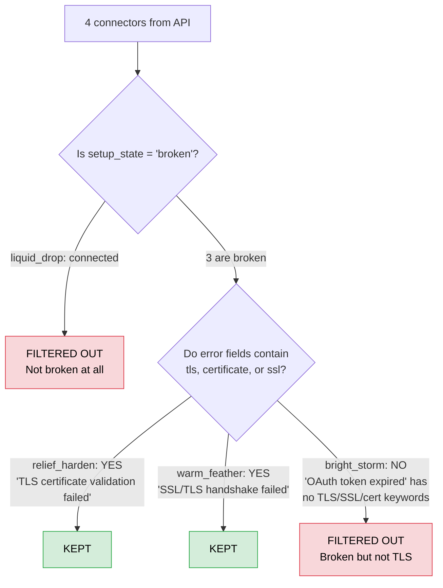

#### Component 17: Add Watermark Columns
- **Type:** `calculator`
- **What it does:** Adds three new columns to each row:

| New Column | Value | Purpose |
|---|---|---|
| `CHECK_DATE` | `CURRENT_DATE()` (e.g., 2026-03-27) | **Daily partition key** — lets you query "show me all connectors that were broken on March 27th" |
| `WATERMARK_DATE` | `CURRENT_TIMESTAMP()` (e.g., 2026-03-27 03:01:45.123) | **Exact discovery time** — precise to the millisecond, useful for debugging |
| `VALIDATION_STATUS` | `'pending'` (literal text) | **Initial status** — will be updated to 'success' or 'failed' after validation |

**What is a watermark?**
In data engineering, a "watermark" is a timestamp that marks when data was processed. It answers: "When did we discover this problem?" This is different from when the connector actually broke (which is `LAST_FAILED_AT`).

#### Component 18: Write to Staging
- **Type:** `rewrite-table`
- **What it does:** Takes the final filtered, enriched dataset and writes it to `FIVETRAN_TLS_BROKEN_STAGING`. This component creates/replaces the table each time.
- **Target table:** `FIVETRAN_TLS_BROKEN_STAGING`
- **Why "rewrite" instead of "append"?** We want a fresh staging table each run containing only today's data. Tomorrow's run will overwrite it completely.

---

## 8. Pipeline 3: Validation Sub-Orchestration (The Fixer)

**File:** `Validate_TLS_Connection.orch.yaml`
**Components:** 4 | **Variables:** 2 (PUBLIC, received from parent pipeline)
**Purpose:** Tests a single Fivetran connector with `trust_certificates=true` and records the result.

### How This Pipeline Gets Called

This pipeline **never runs on its own**. It's called by the Table Iterator in Pipeline 1, once for each broken connector. Each time it runs:

1. It receives `broken_connector_id` (e.g., `relief_harden`)
2. It receives `broken_connector_name` (e.g., `mysql_rds`)
3. It tests that specific connector
4. It updates the log with the result
5. Control returns to the iterator, which moves to the next row

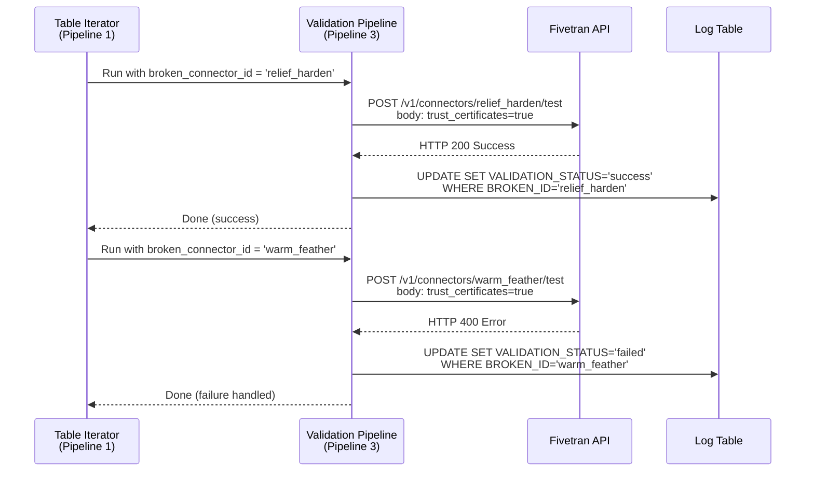

### Component-by-Component Deep Dive

#### Component 19: Start
- **Type:** `start`
- **Transition:** `unconditional` → Test Connection

#### Component 20: Test Connection
- **Type:** `webhook-post`
- **What it does:** Sends an HTTP POST request to the Fivetran API to test a specific connector with `trust_certificates=true`.
- **URL:** `https://api.fivetran.com/v1/connectors/${broken_connector_id}/test`
  - At runtime, `${broken_connector_id}` is replaced with the actual ID (e.g., `relief_harden`)
  - So the actual URL becomes: `https://api.fivetran.com/v1/connectors/relief_harden/test`
- **Payload:**
  ```json
  {"trust_certificates": true, "trust_fingerprints": true}
  ```
- **Branching behavior:**
  - If Fivetran responds with HTTP 2xx (success) → follows `success` transition
  - If Fivetran responds with HTTP 4xx/5xx (error) → follows `failure` transition

#### Component 21: Mark as Fixed
- **Type:** `sql-executor`
- **When reached:** Only when the test succeeded (HTTP 2xx)
- **SQL:**
  ```sql
  UPDATE FIVETRAN_TLS_BROKEN_LOG
  SET VALIDATION_STATUS = 'success',
      VALIDATION_MESSAGE = 'Connection test passed with trust_certificates=true',
      VALIDATED_AT = CURRENT_TIMESTAMP()
  WHERE BROKEN_ID = '${broken_connector_id}'
    AND CHECK_DATE = CURRENT_DATE();
  ```
- **What this means:** The connector was successfully re-tested. Trusting the certificate resolved the issue. The connector should now be syncing data again.

#### Component 22: Mark as Failed
- **Type:** `sql-executor`
- **When reached:** Only when the test failed (HTTP 4xx/5xx)
- **SQL:**
  ```sql
  UPDATE FIVETRAN_TLS_BROKEN_LOG
  SET VALIDATION_STATUS = 'failed',
      VALIDATION_MESSAGE = 'Connection test failed - manual review required',
      VALIDATED_AT = CURRENT_TIMESTAMP()
  WHERE BROKEN_ID = '${broken_connector_id}'
    AND CHECK_DATE = CURRENT_DATE();
  ```
- **What this means:** Trusting the certificate wasn't enough. The connector has a deeper problem that needs human investigation (e.g., the server is actually down, firewall rules changed, database password expired alongside the cert issue).

---

## 9. Complete Data Flow — Tracing 4 Real Connectors

This section traces the **exact same 4 connectors** from Section 4 through every single step of the pipeline. Follow along to see exactly what happens to each row at each stage.

### Stage 1: Raw API Data → `RAW_FIVETRAN_CONNECTIONS`

**What happens:** The Custom Connector calls `GET /v1/connectors` and loads each connection as a row into Snowflake.

| id | service | group_id | schema | setup_state | failed_at | status (VARIANT) |
|---|---|---|---|---|---|---|
| relief_harden | mysql_rds | group_projection | mysql_rds_schema | broken | 2026-03-27T02:15:33Z | `{"setup_state":"broken","tasks":[{"code":"reconnect","message":"TLS certificate validation failed..."}],...}` |
| liquid_drop | postgres_rds | group_projection | postgres_schema | connected | null | `{"setup_state":"connected","tasks":[],...}` |
| warm_feather | sql_server_rds | group_projection | sqlserver_schema | broken | 2026-03-27T02:45:00Z | `{"setup_state":"broken","tasks":[{"code":"reconnect","message":"SSL/TLS handshake failed..."}],...}` |
| bright_storm | google_analytics | group_analytics | ga4_schema | broken | 2026-03-27T03:00:00Z | `{"setup_state":"broken","tasks":[{"code":"reconnect","message":"OAuth token expired"}],...}` |

**Row count: 4** (all connectors, regardless of status)

### Stage 2: Extract Nested Data → JSON Unpacked

**What happens:** The nested `status` JSON object is unpacked into 4 new columns.

| id | service | setup_state | STATUS_SETUP_STATE | STATUS_TASKS | STATUS_WARNINGS | SETUP_TESTS |
|---|---|---|---|---|---|---|
| relief_harden | mysql_rds | broken | broken | `[{"code":"reconnect","message":"TLS certificate validation failed..."}]` | `[]` | `[{"title":"Connecting to host","status":"FAILED","message":"SSL certificate verify failed..."}]` |
| liquid_drop | postgres_rds | connected | connected | `[]` | `[]` | `[{"title":"Connecting","status":"PASSED",...}]` |
| warm_feather | sql_server_rds | broken | broken | `[{"code":"reconnect","message":"SSL/TLS handshake failed..."}]` | `[{"code":"cert_expiry","message":"Server certificate expires in 3 days"}]` | `[{"title":"Connecting","status":"FAILED","message":"TLS handshake error..."}]` |
| bright_storm | google_analytics | broken | broken | `[{"code":"reconnect","message":"OAuth token expired"}]` | `[]` | `[{"title":"Authenticating","status":"FAILED","message":"Invalid credentials"}]` |

**Row count: 4** (unchanged — Extract Nested Data adds columns, doesn't remove rows)

### Stage 3: Rename Fields → Column Names Updated

**What happens:** Columns get descriptive names matching the log table schema.

| BROKEN_ID | CONNECTOR_SERVICE | GROUP_ID | CONNECTOR_SCHEMA | CONNECTOR_SETUP_STATE | LAST_FAILED_AT | ERROR_REASON | STATUS_SETUP_STATE | STATUS_TASKS | STATUS_WARNINGS | SETUP_TESTS |
|---|---|---|---|---|---|---|---|---|---|---|
| relief_harden | mysql_rds | group_projection | mysql_rds_schema | broken | 2026-03-27T02:15:33Z | `{...full status...}` | broken | `[...]` | `[]` | `[...]` |
| liquid_drop | postgres_rds | group_projection | postgres_schema | connected | null | `{...}` | connected | `[]` | `[]` | `[...]` |
| warm_feather | sql_server_rds | group_projection | sqlserver_schema | broken | 2026-03-27T02:45:00Z | `{...}` | broken | `[...]` | `[...]` | `[...]` |
| bright_storm | google_analytics | group_analytics | ga4_schema | broken | 2026-03-27T03:00:00Z | `{...}` | broken | `[...]` | `[]` | `[...]` |

**Row count: 4** (unchanged — Calculator adds columns, doesn't remove rows)

### Stage 4: Filter TLS Broken Only → The Critical Step

**What happens:** Each connector is evaluated against the filter criteria:

| Connector | Is broken? | Contains tls/certificate/ssl? | Result |
|---|---|---|---|
| relief_harden | YES (broken) | YES — tasks: "TLS certificate", tests: "SSL certificate" | **KEPT** |
| liquid_drop | NO (connected) | N/A | **REMOVED** |
| warm_feather | YES (broken) | YES — tasks: "SSL/TLS handshake", tests: "TLS handshake" | **KEPT** |
| bright_storm | YES (broken) | NO — tasks: "OAuth token expired", tests: "Invalid credentials" | **REMOVED** |

**Row count: 2** (down from 4 — only TLS-broken connectors remain)

### Stage 5: Add Watermarks → Timestamps Added

| BROKEN_ID | CONNECTOR_SERVICE | CHECK_DATE | WATERMARK_DATE | VALIDATION_STATUS | ...other columns... |
|---|---|---|---|---|---|
| relief_harden | mysql_rds | 2026-03-27 | 2026-03-27 03:01:45.123 | pending | ... |
| warm_feather | sql_server_rds | 2026-03-27 | 2026-03-27 03:01:45.123 | pending | ... |

**Row count: 2** (unchanged — three new columns added)

### Stage 6: Write to Staging → `FIVETRAN_TLS_BROKEN_STAGING`

The 2 rows are written to the staging table. Transformation pipeline is complete.

### Stage 7: MERGE Into Log → `FIVETRAN_TLS_BROKEN_LOG`

Back in the orchestration pipeline. The MERGE inserts these 2 rows into the permanent log:

| BROKEN_ID | CONNECTOR_SERVICE | CHECK_DATE | VALIDATION_STATUS | VALIDATION_MESSAGE | VALIDATED_AT |
|---|---|---|---|---|---|
| relief_harden | mysql_rds | 2026-03-27 | pending | NULL | NULL |
| warm_feather | sql_server_rds | 2026-03-27 | pending | NULL | NULL |

### Stage 8: Iterate → Validate Each Connector

**Iteration 1:** `broken_connector_id = 'relief_harden'`
- Webhook POSTs to `https://api.fivetran.com/v1/connectors/relief_harden/test`
- Fivetran responds: HTTP 200 (success!)
- Log updated: `VALIDATION_STATUS = 'success'`

**Iteration 2:** `broken_connector_id = 'warm_feather'`
- Webhook POSTs to `https://api.fivetran.com/v1/connectors/warm_feather/test`
- Fivetran responds: HTTP 400 (still failing)
- Log updated: `VALIDATION_STATUS = 'failed'`

### Stage 9: Final Log Table State

| BROKEN_ID | CONNECTOR_SERVICE | CHECK_DATE | WATERMARK_DATE | VALIDATION_STATUS | VALIDATION_MESSAGE | VALIDATED_AT |
|---|---|---|---|---|---|---|
| relief_harden | mysql_rds | 2026-03-27 | 2026-03-27 03:01:45 | **success** | Connection test passed with trust_certificates=true | 2026-03-27 03:02:10 |
| warm_feather | sql_server_rds | 2026-03-27 | 2026-03-27 03:01:45 | **failed** | Connection test failed - manual review required | 2026-03-27 03:02:15 |

### Stage 10: Notifications Sent

**Variables after Count Results:**
- `total_broken = 2`
- `total_fixed = 1`
- `total_failed = 1`
- `total_pending = 0`
- `check_date = '2026-03-27'`

**Slack message:**
> :wrench: **Daily Fivetran TLS Fix Report**
> Date: 2026-03-27
> Total broken: 2
> Fixed: 1
> Still failing: 1
> Pending: 0

**Email sent to:** admin@inupup.com
**SNS published to:** fivetran-tls-fix-alerts topic

### Stage 11: Cleanup

Both `RAW_FIVETRAN_CONNECTIONS` and `FIVETRAN_TLS_BROKEN_STAGING` are dropped.
Only `FIVETRAN_TLS_BROKEN_LOG` remains — the permanent audit trail.

### What the Log Table Looks Like After Multiple Days

Here's what builds up over a week of daily runs:

| BROKEN_ID | CONNECTOR_SERVICE | CHECK_DATE | VALIDATION_STATUS | VALIDATION_MESSAGE |
|---|---|---|---|---|
| relief_harden | mysql_rds | 2026-03-27 | success | Connection test passed with trust_certificates=true |
| warm_feather | sql_server_rds | 2026-03-27 | failed | Connection test failed - manual review required |
| warm_feather | sql_server_rds | 2026-03-28 | failed | Connection test failed - manual review required |
| relief_harden | mysql_rds | 2026-03-28 | success | Connection test passed with trust_certificates=true |
| new_spark | mongodb | 2026-03-28 | success | Connection test passed with trust_certificates=true |
| warm_feather | sql_server_rds | 2026-03-29 | success | Connection test passed with trust_certificates=true |

**Notice:**
- `warm_feather` appears 3 days in a row — broke on the 27th, stayed broken on the 28th, finally fixed on the 29th
- `relief_harden` appears on both the 27th and 28th — it got fixed, then broke again (a cert was temporarily renewed, then expired again)
- `new_spark` is new on the 28th — a new connector that developed a TLS issue
- Each row is a **separate daily snapshot** — you can see the full history of each connector

### Data Flow Summary Diagram

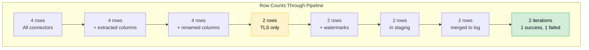

---

## 10. How Every Component Works Internally

### Custom Connector — How Cursor Pagination Works

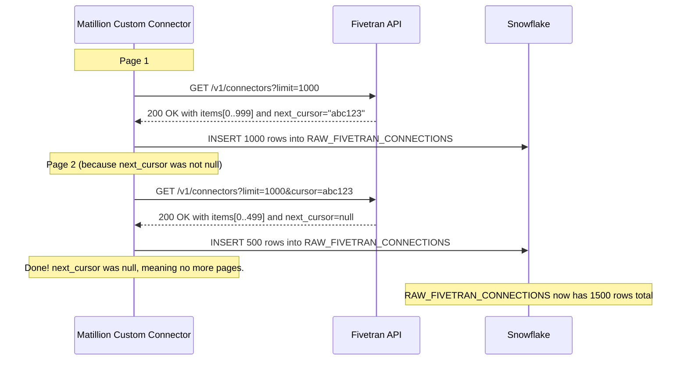

### Extract Nested Data — How JSON Unpacking Works

```mermaid
sequenceDiagram
    participant ROW as Input Row
    participant END as Extract Nested Data
    participant OUT as Output Row

    ROW->>END: Row with 'status' column = VARIANT JSON blob

    Note over END: Reads configuration: extract these fields from 'status' column

    END->>END: Extract status.setup_state as VARCHAR to STATUS_SETUP_STATE
    END->>END: Extract status.tasks as VARIANT to STATUS_TASKS
    END->>END: Extract status.warnings as VARIANT to STATUS_WARNINGS
    END->>END: Extract status.setup_tests as VARIANT to SETUP_TESTS

    Note over END: Casting - if any value cannot be parsed, replace with NULL
    Note over END: Outer join - keep the row even if some fields are missing

    END->>OUT: Original 11 columns plus 4 new extracted columns equals 15 columns
```

### Table Iterator — How the Loop Works

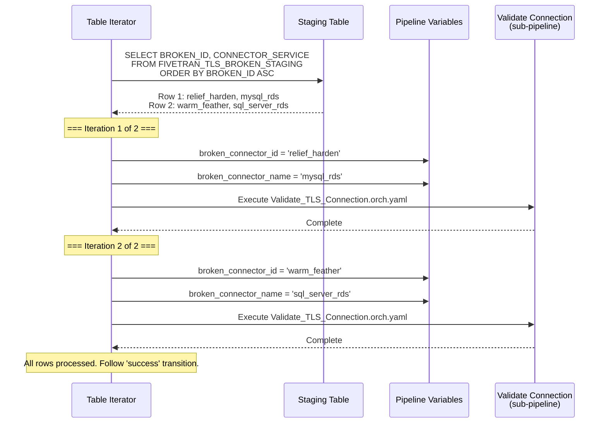

### MERGE INTO — How Deduplication Works

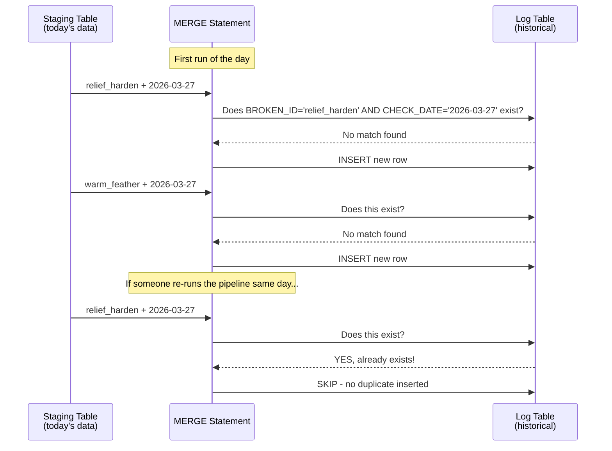

---

## 11. Log Table Schema & Partitioning Strategy

### `FIVETRAN_TLS_BROKEN_LOG` — All 16 Columns Explained

| # | Column | Type | NOT NULL | Default | What It Stores | Example Value |
|---|---|---|---|---|---|---|
| 1 | `BROKEN_ID` | VARCHAR(256) | YES | — | The unique Fivetran connector ID | `relief_harden` |
| 2 | `CONNECTOR_SERVICE` | VARCHAR(256) | | — | What type of data source this connector syncs from | `mysql_rds` |
| 3 | `GROUP_ID` | VARCHAR(256) | | — | Which Fivetran group/project this belongs to | `group_projection` |
| 4 | `CONNECTOR_SCHEMA` | VARCHAR(256) | | — | The Snowflake schema where this connector lands its data | `mysql_rds_schema` |
| 5 | `LAST_FAILED_AT` | VARCHAR(64) | | — | When the connector last failed (from Fivetran API) | `2026-03-27T02:15:33Z` |
| 6 | `CONNECTOR_SETUP_STATE` | VARCHAR(64) | | — | Top-level setup state from the API | `broken` |
| 7 | `STATUS_SETUP_STATE` | VARCHAR(64) | | — | Setup state from the nested status object | `broken` |
| 8 | `SETUP_TESTS` | VARIANT | | — | Full setup test results as JSON array | `[{"title":"Connecting","status":"FAILED",...}]` |
| 9 | `STATUS_TASKS` | VARIANT | | — | Active error tasks as JSON array | `[{"code":"reconnect","message":"TLS..."}]` |
| 10 | `STATUS_WARNINGS` | VARIANT | | — | Active warnings as JSON array | `[{"code":"cert_expiry",...}]` |
| 11 | `ERROR_REASON` | VARCHAR(4096) | | — | Full status object as text (for keyword search) | `{"setup_state":"broken",...}` |
| 12 | `CHECK_DATE` | DATE | YES | — | **Daily partition key** — which day this was discovered | `2026-03-27` |
| 13 | `WATERMARK_DATE` | TIMESTAMP | YES | — | Exact timestamp when the pipeline processed this row | `2026-03-27 03:01:45.123` |
| 14 | `VALIDATION_STATUS` | VARCHAR(64) | | `pending` | Current state: `pending`, `success`, or `failed` | `success` |
| 15 | `VALIDATION_MESSAGE` | VARCHAR(4096) | | — | Human-readable description of what happened | `Connection test passed with trust_certificates=true` |
| 16 | `VALIDATED_AT` | TIMESTAMP | | — | When the validation was completed | `2026-03-27 03:02:10` |

### Partitioning Strategy — How CHECK_DATE Enables Time-Based Analysis

The `CHECK_DATE` column is the **partition key** for this table. This means:

**Query: "What broke today?"**
```sql
SELECT * FROM FIVETRAN_TLS_BROKEN_LOG
WHERE CHECK_DATE = CURRENT_DATE();
```

**Query: "What broke this week?"**
```sql
SELECT * FROM FIVETRAN_TLS_BROKEN_LOG
WHERE CHECK_DATE >= DATEADD(day, -7, CURRENT_DATE());
```

**Query: "Which connectors break repeatedly?"**
```sql
SELECT BROKEN_ID, CONNECTOR_SERVICE, COUNT(*) AS times_broken
FROM FIVETRAN_TLS_BROKEN_LOG
GROUP BY BROKEN_ID, CONNECTOR_SERVICE
ORDER BY times_broken DESC;
```

**Query: "What's our fix success rate?"**
```sql
SELECT
    CHECK_DATE,
    COUNT(*) AS total,
    SUM(CASE WHEN VALIDATION_STATUS = 'success' THEN 1 ELSE 0 END) AS fixed,
    SUM(CASE WHEN VALIDATION_STATUS = 'failed' THEN 1 ELSE 0 END) AS still_broken,
    ROUND(SUM(CASE WHEN VALIDATION_STATUS = 'success' THEN 1 ELSE 0 END) * 100.0 / COUNT(*), 1) AS fix_rate_pct
FROM FIVETRAN_TLS_BROKEN_LOG
GROUP BY CHECK_DATE
ORDER BY CHECK_DATE DESC;
```

### Why Two Date Columns?

| Column | Type | Granularity | Purpose |
|---|---|---|---|
| `CHECK_DATE` | DATE | Day | Partitioning, grouping, "which day" queries |
| `WATERMARK_DATE` | TIMESTAMP | Millisecond | Precise timing, debugging, "exactly when" queries |

Having both lets you do both high-level daily reporting AND precise debugging when needed.

### Advanced Analytical Queries

**Which connectors have been broken the most in the last 30 days?**
```sql
SELECT
    BROKEN_ID,
    CONNECTOR_SERVICE,
    COUNT(*) AS days_broken,
    MIN(CHECK_DATE) AS first_seen,
    MAX(CHECK_DATE) AS last_seen,
    SUM(CASE WHEN VALIDATION_STATUS = 'success' THEN 1 ELSE 0 END) AS times_auto_fixed,
    SUM(CASE WHEN VALIDATION_STATUS = 'failed' THEN 1 ELSE 0 END) AS times_still_broken
FROM FIVETRAN_TLS_BROKEN_LOG
WHERE CHECK_DATE >= DATEADD(day, -30, CURRENT_DATE())
GROUP BY BROKEN_ID, CONNECTOR_SERVICE
ORDER BY days_broken DESC;
```

**Daily fix success rate over the last 2 weeks:**
```sql
SELECT
    CHECK_DATE,
    COUNT(*) AS total_broken,
    SUM(CASE WHEN VALIDATION_STATUS = 'success' THEN 1 ELSE 0 END) AS fixed,
    SUM(CASE WHEN VALIDATION_STATUS = 'failed' THEN 1 ELSE 0 END) AS still_broken,
    ROUND(fixed * 100.0 / NULLIF(total_broken, 0), 1) AS fix_rate_pct
FROM FIVETRAN_TLS_BROKEN_LOG
WHERE CHECK_DATE >= DATEADD(day, -14, CURRENT_DATE())
GROUP BY CHECK_DATE
ORDER BY CHECK_DATE DESC;
```

**Connectors that broke yesterday but weren't broken the day before (new issues):**
```sql
SELECT l.*
FROM FIVETRAN_TLS_BROKEN_LOG l
WHERE l.CHECK_DATE = DATEADD(day, -1, CURRENT_DATE())
  AND l.BROKEN_ID NOT IN (
    SELECT BROKEN_ID FROM FIVETRAN_TLS_BROKEN_LOG
    WHERE CHECK_DATE = DATEADD(day, -2, CURRENT_DATE())
  );
```

**Average time between discovery and validation:**
```sql
SELECT
    AVG(DATEDIFF(second, WATERMARK_DATE, VALIDATED_AT)) AS avg_seconds_to_validate,
    MIN(DATEDIFF(second, WATERMARK_DATE, VALIDATED_AT)) AS fastest,
    MAX(DATEDIFF(second, WATERMARK_DATE, VALIDATED_AT)) AS slowest
FROM FIVETRAN_TLS_BROKEN_LOG
WHERE VALIDATED_AT IS NOT NULL;
```

**Which Fivetran groups have the most TLS issues?**
```sql
SELECT
    GROUP_ID,
    COUNT(DISTINCT BROKEN_ID) AS unique_connectors,
    COUNT(*) AS total_incidents,
    LISTAGG(DISTINCT CONNECTOR_SERVICE, ', ') AS service_types
FROM FIVETRAN_TLS_BROKEN_LOG
GROUP BY GROUP_ID
ORDER BY total_incidents DESC;
```

### Building a Dashboard

You can create a BI dashboard (in Looker, Tableau, Power BI, etc.) on top of this log table with these recommended visuals:

| Visual | Query Basis | Shows |
|---|---|---|
| **Line chart** | Daily fix_rate_pct over time | Trending — are we getting better or worse? |
| **Bar chart** | Top 10 most-broken connectors | Focus areas — which connectors need permanent fixes? |
| **KPI cards** | Today's total_broken, total_fixed, total_failed | Current state at a glance |
| **Table** | Today's failed connectors with details | Action items — what needs manual review? |
| **Stacked bar** | Daily broken count by connector service type | Pattern detection — are certain service types more prone? |

---

## 12. Pipeline Variables — Complete Reference

### What Are Pipeline Variables?

Variables are named placeholders that store values during pipeline execution. They're referenced with `${variable_name}` syntax and get replaced with actual values at runtime.

### Main Orchestration Variables (13 total)

#### Iterator Variables (Set by Table Iterator, used by sub-pipeline)

| Variable | Type | Scope | Visibility | Default | Purpose |
|---|---|---|---|---|---|
| `broken_connector_id` | TEXT | COPIED | PRIVATE | `""` | Current connector ID being validated. Set by iterator for each row. |
| `broken_connector_name` | TEXT | COPIED | PRIVATE | `""` | Current connector service name. Set by iterator for each row. |

> **Why COPIED scope?** COPIED means each concurrent execution gets its own copy. Essential for iterator variables — otherwise parallel iterations would overwrite each other's values. (We use sequential execution, but COPIED is still best practice.)

#### Notification Configuration Variables (Set by you before running)

| Variable | Type | Scope | Visibility | Default | What to Set It To |
|---|---|---|---|---|---|
| `slack_webhook_url` | TEXT | SHARED | PUBLIC | `https://hooks.slack.com/services/YOUR/WEBHOOK/URL` | Your actual Slack incoming webhook URL |
| `email_recipient` | TEXT | SHARED | PUBLIC | `admin@inupup.com` | Who receives the email report |
| `email_sender` | TEXT | SHARED | PUBLIC | `noreply@inupup.com` | The "from" address on the email |
| `smtp_username` | TEXT | SHARED | PUBLIC | `noreply@inupup.com` | SMTP login username (often same as sender) |
| `smtp_hostname` | TEXT | SHARED | PUBLIC | `smtp.gmail.com` | Your SMTP server address |

#### Report Variables (Set automatically by Count Results component)

| Variable | Type | Scope | Visibility | Default | How It Gets Set |
|---|---|---|---|---|---|
| `check_date` | TEXT | SHARED | PRIVATE | `""` | `SET check_date = CURRENT_DATE()::VARCHAR` |
| `total_broken` | NUMBER | SHARED | PRIVATE | `0` | `SET total_broken = COUNT(*) WHERE CHECK_DATE = today` |
| `total_fixed` | NUMBER | SHARED | PRIVATE | `0` | `SET total_fixed = COUNT(*) WHERE status = 'success'` |
| `total_failed` | NUMBER | SHARED | PRIVATE | `0` | `SET total_failed = COUNT(*) WHERE status = 'failed'` |
| `total_pending` | NUMBER | SHARED | PRIVATE | `0` | `SET total_pending = COUNT(*) WHERE status = 'pending'` |

### Validation Sub-Pipeline Variables (2 total)

| Variable | Type | Scope | Visibility | Default | How It Gets Set |
|---|---|---|---|---|---|
| `broken_connector_id` | TEXT | COPIED | PUBLIC | `""` | Passed from parent via `setScalarVariables` |
| `broken_connector_name` | TEXT | COPIED | PUBLIC | `""` | Passed from parent via `setScalarVariables` |

> **Why PUBLIC visibility?** PUBLIC variables can be overridden when calling the pipeline from another pipeline. PRIVATE variables cannot be set from outside.

### Variable Lifecycle — How Variables Flow Through Execution

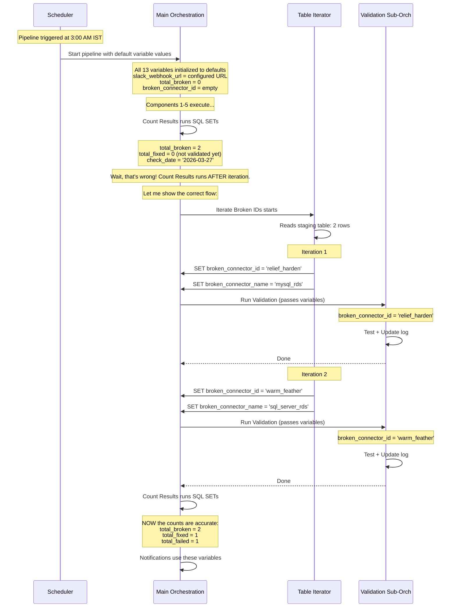

### Variable Scoping — COPIED vs SHARED Explained

| Scope | Behavior | When to Use | Our Usage |
|---|---|---|---|
| **SHARED** | One copy for the entire pipeline. All components see the same value. If one component changes it, all subsequent components see the new value. | Configuration values, counters, report data | `slack_webhook_url`, `total_broken`, `check_date` |
| **COPIED** | Each concurrent branch gets its own copy. Changes in one branch don't affect other branches. | Iterator variables, anything that changes per-iteration | `broken_connector_id`, `broken_connector_name` |

**Why this matters for iterators:**
If `broken_connector_id` were SHARED and the iterator ran concurrently:
- Iteration 1 sets `broken_connector_id = 'relief_harden'`
- Iteration 2 immediately sets `broken_connector_id = 'warm_feather'`
- Iteration 1's validation now uses `warm_feather` instead of `relief_harden`! 💥

With COPIED scope, each iteration has its own copy, preventing this race condition.

---

## 13. Setup Instructions — Step by Step

### Step 1: Create the Fivetran API Secret in Matillion

1. Go to **Matillion DPC** → **Secrets Management**
2. Create a new secret:
   - **Name:** `fivetran_api_secret`
   - **Value:** Your Fivetran API Secret (from Fivetran Dashboard → Settings → API Key)
3. This will be used by the Custom Connector for authentication.

### Step 2: Create the SMTP Password Secret

1. In **Secrets Management**, create another secret:
   - **Name:** `smtp_password_secret`
   - **Value:** Your email password or app-specific password
2. For Gmail, you need an **App Password** (not your regular password):
   - Go to myaccount.google.com → Security → 2-Step Verification → App Passwords
   - Generate a password for "Mail"

### Step 3: Create the Custom Connector in Matillion UI

This is the most important setup step. The pipeline currently has a SQL placeholder that needs to be replaced with a real Custom Connector.

1. In Matillion DPC, go to **Custom Connectors**
2. Create a new connector called `Fivetran TLS Manager`
3. Configure:
   - **Base URL:** `https://api.fivetran.com`
   - **Authentication:** Basic Auth
     - Username: Your Fivetran API Key
     - Password: Secret reference `fivetran_api_secret`
4. Add **Endpoint 1 — Get All Connections:**
   - Method: GET
   - Path: `/v1/connectors`
   - Pagination: Cursor-based
     - Cursor field: `data.next_cursor`
     - Cursor parameter: `cursor`
   - Query Parameters:
     - `limit`: 1000
   - Target Table: `RAW_FIVETRAN_CONNECTIONS`
5. After creating, **replace** the `Fetch All Connections` SQL executor component in the main orchestration with your Custom Connector component.

### Step 4: Configure Pipeline Variables

1. Open `fivetran_tls_daily_fix.orch.yaml` in the Designer
2. Click on **Variables** in the properties panel
3. Update these values:

| Variable | Set To |
|---|---|
| `slack_webhook_url` | Your Slack incoming webhook URL |
| `email_recipient` | Your team's email address |
| `email_sender` | Your sending email address |
| `smtp_username` | Your SMTP login (often same as sender) |
| `smtp_hostname` | Your SMTP server (e.g., `smtp.gmail.com`) |

### Step 5: Configure AWS SNS (Optional)

1. In AWS Console, create an SNS topic called `fivetran-tls-fix-alerts`
2. Add subscribers (email, SMS, Lambda, etc.)
3. Ensure Matillion's AWS role has `sns:Publish` permission on this topic
4. Update the `awsRegion` in the SNS Alert component if not `us-east-1`

### Step 6: Schedule the Pipeline

1. In Matillion DPC, go to **Scheduling**
2. Create a new schedule:
   - **Pipeline:** `fivetran_tls_daily_fix.orch.yaml`
   - **Frequency:** Daily
   - **Time:** 9:30 PM UTC (= 3:00 AM IST next day)
   - **Environment:** Your production environment
3. Save and enable the schedule

### Step 7: Test with a Manual Run

1. Open `fivetran_tls_daily_fix.orch.yaml`
2. Click **Run** to execute manually
3. Watch the execution and check:
   - Does the log table get created?
   - Does the Custom Connector fetch data?
   - Does the filter correctly identify TLS issues?
   - Do notifications arrive?
4. Check the log table: `SELECT * FROM FIVETRAN_TLS_BROKEN_LOG;`

---

## 14. Error Handling & Edge Cases

### What If There Are No TLS-Broken Connectors?

This is the **happy path**! The pipeline handles it gracefully:
1. Fetch All Connections → loads all connectors
2. Transform and Filter → filter returns **0 rows**
3. Write to Staging → creates an empty staging table
4. MERGE Into Log → nothing to merge (0 rows in staging)
5. Iterate Broken IDs → **0 iterations** (empty table = nothing to loop)
6. Count Results → all counts = 0
7. Notifications → reports "Total broken: 0, Fixed: 0, Failed: 0, Pending: 0"
8. Cleanup → drops empty temp tables

No errors, no failures — just a clean report that everything is fine.

### What If the Fivetran API Is Down?

The `Fetch All Connections` component will fail. Since the transition to `Transform and Filter` is `success` only, the pipeline stops here. No partial data gets processed, no false notifications get sent.

### What If One Validation Fails But Others Succeed?

The Table Iterator has `breakOnFailure: No`, meaning:
- If `relief_harden` validation fails → continue to `warm_feather`
- The iterator completes all rows regardless of individual failures
- Each connector gets its own status in the log (success or failed)

### What If Slack Is Down?

The transition from `Notify Slack` to `Send Email Report` is `unconditional` — it proceeds whether Slack succeeded or failed. Same for Email → SNS. This is the **triple notification graceful degradation** pattern:

```mermaid
flowchart LR
    SL["Slack"] -- "unconditional<br>(even if Slack fails)" --> EM["Email"]
    EM -- "unconditional<br>(even if Email fails)" --> SN["SNS"]
```

### What If the Pipeline Runs Twice in One Day?

The MERGE INTO statement prevents duplicates. The second run:
1. Fetches fresh data (might find new broken connectors)
2. Filters → same or different results
3. MERGE → only inserts truly NEW rows (skips already-existing BROKEN_ID + CHECK_DATE combinations)
4. Iterator → only validates connectors in today's staging (might re-validate some)
5. UPDATE → overwrites the validation status (harmless — same result)

### What If a Connector Has Multiple Error Types?

For example, a connector broken by BOTH a TLS issue AND a password expiry. Our filter will catch it (because it contains TLS keywords). The validation will run `trust_certificates=true`, which might fix the TLS part but the connector might still fail due to the password issue. In that case, `VALIDATION_STATUS = 'failed'` and the message will indicate manual review is needed.

### What If Snowflake Is Under Maintenance?

If Snowflake is completely unavailable, the pipeline cannot run at all (it needs Snowflake for every step). The scheduled run will fail, and you'll see the failure in Matillion's execution history. The next day's run will work normally once Snowflake is back.

### What If You Have Hundreds of Broken Connectors?

With sequential execution at ~5 seconds per connector:
- 10 connectors: ~50 seconds
- 50 connectors: ~4 minutes
- 100 connectors: ~8 minutes
- 500 connectors: ~42 minutes

If you regularly have 100+ TLS-broken connectors, consider switching the iterator to `Concurrent` execution (faster but uses more API quota).

### Error Recovery Flow

```mermaid
flowchart TB
    START["Pipeline starts"] --> INIT{"Init Log Table?"}
    INIT -- "Success" --> FETCH{"Fetch All Connections?"}
    INIT -- "Failure" --> E1["STOP: Snowflake permission issue<br>Check role has CREATE TABLE"]
    FETCH -- "Success" --> TRANS{"Transform and Filter?"}
    FETCH -- "Failure" --> E2["STOP: API issue<br>Check API key, network, Fivetran status"]
    TRANS -- "Success" --> MERGE{"Merge Into Log?"}
    TRANS -- "Failure" --> E3["STOP: Transformation issue<br>Check table exists, columns match"]
    MERGE -- "Success" --> ITER{"Iterate?"}
    MERGE -- "Failure" --> E4["STOP: SQL issue<br>Check MERGE syntax, column types"]
    ITER -- "Success" --> COUNT["Count Results"]
    ITER -- "Partial failures" --> COUNT
    COUNT --> NOTIFY["Notifications<br>(unconditional chain)"]
    NOTIFY --> CLEAN["Cleanup"]

    style E1 fill:#f8d7da,stroke:#dc3545,color:#000
    style E2 fill:#f8d7da,stroke:#dc3545,color:#000
    style E3 fill:#f8d7da,stroke:#dc3545,color:#000
    style E4 fill:#f8d7da,stroke:#dc3545,color:#000
```

### Troubleshooting Guide

| Symptom | Likely Cause | How to Fix |
|---|---|---|
| Pipeline fails at Init Log Table | Snowflake permission issue | Grant CREATE TABLE to Matillion role |
| Pipeline fails at Fetch All Connections | API credentials wrong or placeholder not replaced | Create Custom Connector and replace SQL placeholder |
| Transform returns 0 rows when you expect some | Filter keywords don't match error messages | Check the actual error messages in `RAW_FIVETRAN_CONNECTIONS.status` column |
| MERGE fails with column mismatch | Log table schema doesn't match staging | Drop and recreate the log table (Init will recreate it) |
| Iterator runs but all validations fail | Fivetran API auth not configured on webhook | Add Basic Auth headers to the Webhook POST component |
| Slack notification fails | Invalid webhook URL | Test the URL with `curl -X POST -H 'Content-type: application/json' --data '{"text":"test"}' YOUR_URL` |
| Email fails | Wrong SMTP credentials or port | Test SMTP settings with a mail client first; ensure App Password for Gmail |
| SNS fails | AWS credentials not configured | Check Matillion's AWS role has `sns:Publish` permission |
| Log table grows too large | No data retention policy | Add a cleanup step: `DELETE FROM FIVETRAN_TLS_BROKEN_LOG WHERE CHECK_DATE < DATEADD(day, -90, CURRENT_DATE())` |

---

## 15. Frequently Asked Questions

### Q: Can I add more notification channels?
A: Yes! Add any component after `SNS Alert` and before `Cleanup Staging`. Connect with `unconditional` transitions for graceful degradation.

### Q: Can I change the schedule time?
A: Yes, update the schedule in Matillion DPC. The pipeline itself doesn't hard-code the time.

### Q: What if I don't have AWS SNS?
A: The SNS component will fail, but because Email → SNS uses `unconditional` transition, the pipeline continues to Cleanup. You can also disable (skip) the SNS component.

### Q: How long does the log table keep data?
A: Indefinitely. The MERGE only INSERTs, never DELETEs. To manage growth, you could add a cleanup step that removes entries older than N days.

### Q: Can I run this for a specific Fivetran group only?
A: Yes, modify the Custom Connector endpoint to use `GET /v1/groups/{group_id}/connectors` instead of the global `/v1/connectors`.

### Q: Why are iterator variables COPIED scope?
A: COPIED means each execution branch gets its own copy of the variable. This prevents race conditions if the pipeline ever uses concurrent execution.

### Q: What Snowflake permissions are needed?
A: The Matillion role needs:
- `CREATE TABLE` on the target schema
- `INSERT`, `UPDATE`, `MERGE` on the log table
- `DROP TABLE` for cleanup
- `SELECT` on staging tables

### Q: Can I test this without affecting production Fivetran connectors?
A: Yes! The `POST /test` endpoint only **tests** the connection — it doesn't modify connector settings permanently. It temporarily tests with `trust_certificates=true` but doesn't save that setting. You'd need a separate API call to permanently update the connector config.

### Q: What if I want to permanently set trust_certificates on fixed connectors?
A: Add a step after "Mark as Fixed" that calls `PATCH /v1/connectors/{id}` with `{"config": {"trust_certificates": true}}`. This would permanently update the connector config so it doesn't break again.

### Q: Can I filter for different error types (not just TLS)?
A: Absolutely! Modify the filter in Pipeline 2. For example, to catch OAuth issues instead:
```sql
LOWER("STATUS_TASKS"::VARCHAR) LIKE '%oauth%'
OR LOWER("STATUS_TASKS"::VARCHAR) LIKE '%token expired%'
OR LOWER("STATUS_TASKS"::VARCHAR) LIKE '%re-authenticate%'
```

### Q: Can I send notifications to multiple Slack channels?
A: Yes, duplicate the Notify Slack component and point each one to a different webhook URL. Or use a single webhook that posts to a channel, and set up Slack's channel forwarding.

### Q: How do I check if the pipeline ran today?
A: 
```sql
SELECT CHECK_DATE, COUNT(*) AS connectors_logged, MAX(WATERMARK_DATE) AS last_run
FROM FIVETRAN_TLS_BROKEN_LOG
WHERE CHECK_DATE = CURRENT_DATE()
GROUP BY CHECK_DATE;
```
If this returns 0 rows, either the pipeline hasn't run today or there were no TLS-broken connectors.

### Q: Can I add this to an existing orchestration pipeline?
A: Yes! You can add a `run-orchestration` component to your existing pipeline that calls `fivetran_tls_daily_fix.orch.yaml`. This lets you chain it with other daily maintenance tasks.

### Q: What happens if Fivetran adds new status fields in the future?
A: The pipeline won't break — Extract Nested Data only extracts the fields we've configured. New API fields are simply ignored. If you want to capture new fields, add them to the Extract Nested Data configuration and the log table schema.

### Q: Can I backfill historical data?
A: Not directly — the Fivetran API shows current state, not historical. But once this pipeline is running daily, it builds history over time. After 30 days, you'll have 30 days of daily snapshots.

---

## 16. Glossary of Terms

| Term | Definition |
|---|---|
| **API** | Application Programming Interface — a way for software systems to communicate with each other |
| **Basic Auth** | HTTP authentication where username and password are sent with each request (base64 encoded) |
| **Certificate** | A digital document that proves a server's identity, issued by a Certificate Authority |
| **Certificate Authority (CA)** | A trusted organization that issues digital certificates (e.g., Let's Encrypt, DigiCert) |
| **Cursor Pagination** | A method of getting large datasets in pages, where each page includes a "cursor" pointing to the next page |
| **DPL** | Data Pipeline Language — Matillion's YAML-based format for defining pipelines |
| **Idempotent** | An operation that produces the same result whether you run it once or multiple times (our MERGE is idempotent) |
| **Iterator** | A component that loops through rows of data, executing a target component for each row |
| **JSON** | JavaScript Object Notation — a structured text format for data (used by APIs) |
| **MERGE INTO** | A SQL operation that combines INSERT and UPDATE: insert if new, update or skip if existing |
| **Orchestration** | A pipeline type that coordinates actions (create tables, call APIs, run other pipelines) |
| **Partition Key** | A column used to divide data into logical segments (CHECK_DATE divides by day) |
| **REST API** | REpresentational State Transfer — a standard way to design web APIs using HTTP methods (GET, POST, etc.) |
| **Secret Reference** | A pointer to a securely stored credential in Matillion, identified by name (not the actual value) |
| **Self-Signed Certificate** | A certificate created by the server itself, not by a trusted Certificate Authority |
| **SMTP** | Simple Mail Transfer Protocol — the standard for sending emails |
| **SNS** | Amazon Simple Notification Service — AWS service for sending push notifications |
| **SSL** | Secure Sockets Layer — predecessor to TLS (the terms are often used interchangeably) |
| **Staging Table** | A temporary table that holds intermediate data during processing |
| **TLS** | Transport Layer Security — protocol for encrypting data in transit between systems |
| **Transformation** | A pipeline type that processes data within Snowflake (filter, calculate, join, etc.) |
| **Transition** | A connection between orchestration components that defines execution order and conditions |
| **VARIANT** | A Snowflake data type that can store semi-structured data (JSON, arrays, nested objects) |
| **Watermark** | A timestamp marking when data was processed or discovered |
| **Webhook** | An HTTP callback — a URL that accepts incoming HTTP requests (e.g., Slack incoming webhooks) |
| **YAML** | YAML Ain't Markup Language — a human-readable file format used for pipeline definitions (.orch.yaml, .tran.yaml) |
| **Base64** | A way to encode binary data as text characters — used in HTTP Basic Auth to encode credentials |
| **VARIANT** | A Snowflake data type that can store any JSON structure (objects, arrays, nested data) without a fixed schema |
| **COALESCE** | A SQL function that returns the first non-NULL value from a list — used for providing fallback values |
| **CURRENT_DATE()** | A Snowflake function that returns today's date (e.g., 2026-03-27) |
| **CURRENT_TIMESTAMP()** | A Snowflake function that returns the current date AND time with millisecond precision |
| **DATEADD** | A Snowflake function that adds/subtracts time from a date (e.g., DATEADD(day, -7, CURRENT_DATE()) = 7 days ago) |
| **DPC** | Data Productivity Cloud — Matillion's cloud-based platform for building data pipelines |
| **ETL/ELT** | Extract-Transform-Load / Extract-Load-Transform — patterns for moving and processing data |
| **HTTP Method** | The type of API request: GET (read), POST (create/action), PUT (replace), PATCH (update), DELETE (remove) |
| **LIKE** | SQL operator for pattern matching — `%` matches any characters (e.g., `LIKE '%tls%'` matches any string containing "tls") |
| **LOWER()** | SQL function that converts text to lowercase — used for case-insensitive keyword matching |
| **MERGE INTO** | SQL command that combines INSERT and UPDATE: if the row exists, update it; if not, insert it |
| **NULL** | A special value meaning "no data" or "unknown" — different from empty string or zero |
| **Pipeline Variable** | A named placeholder in a pipeline that stores a value (text, number, or grid) during execution |
| **Rate Limit** | A restriction on how many API calls you can make in a time period (to prevent abuse) |
| **Rewrite Table** | A Matillion component that creates/replaces a table with the output of a transformation |
| **Schedule** | An automated trigger that runs a pipeline at specified times (e.g., daily at 3 AM) |
| **Sub-Pipeline** | A pipeline called from another pipeline — allows modular, reusable design |
| **Transition** | A connection between orchestration components that defines execution order and conditions |

---

## 17. Version History

| Version | Date | Changes |
|---|---|---|
| 1.0 | 2026-03-27 | Initial build with Python-based API calls |
| 2.0 | 2026-03-27 | Replaced Python with low-code components |
| 3.0 | 2026-03-27 | Zero-Python final build: 22 components, triple notifications, watermark strategy |
| 3.1 | 2026-03-27 | Added missing API fields (group_id, created_at, failed_at, paused) and 5 new log columns |
| 3.2 | 2026-03-27 | **Comprehensive documentation rewrite** — deep explanations for every concept, component, and data flow step |
